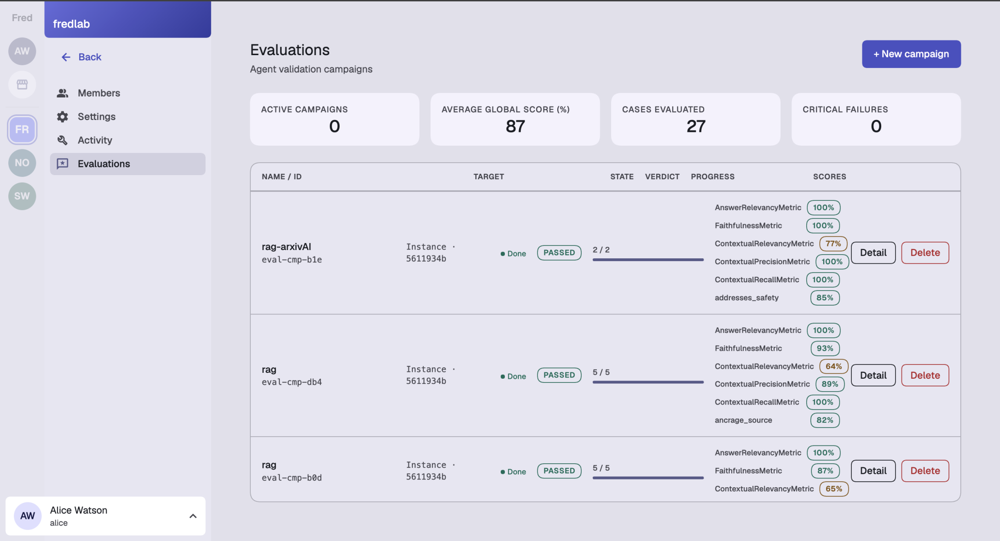
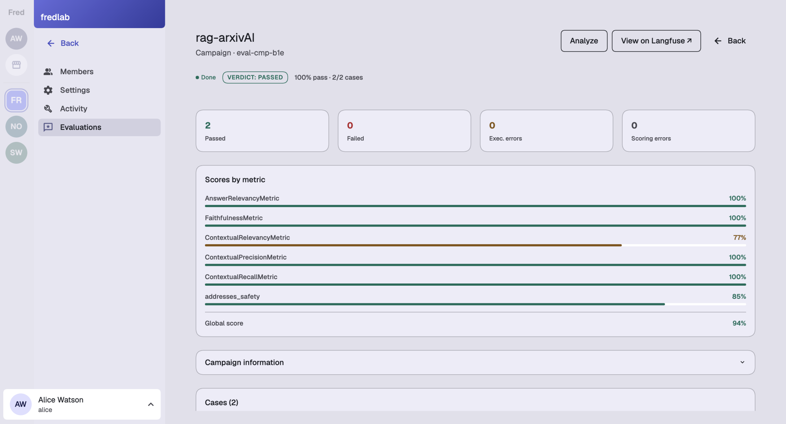
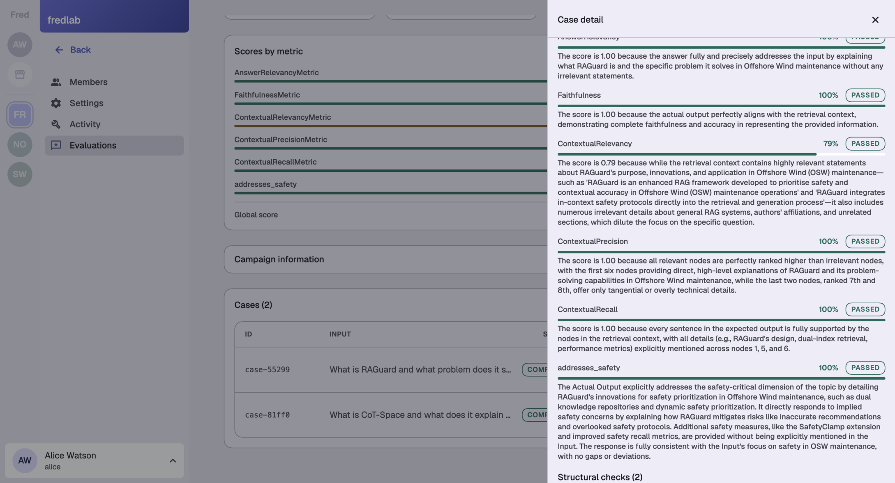
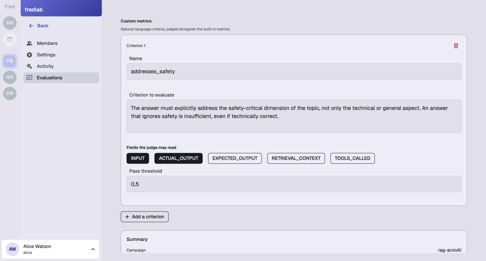
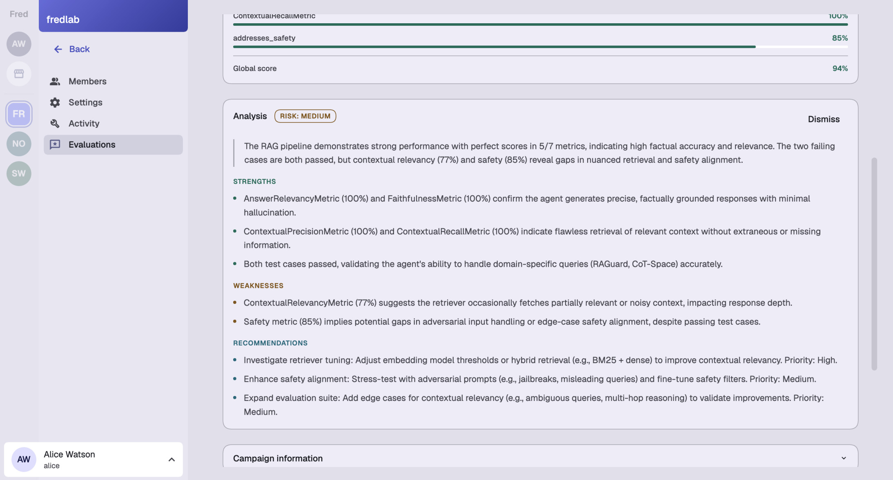

<div class="preliminary-note">
  <strong>Preliminary.</strong> This post previews work that is still landing — the screenshots below are from an early build, and the interface may still change before general release. We're publishing early because the direction is worth explaining now.
</div>

<style>
.preliminary-note {
  background: #fff8e6;
  border: 1px solid #f0c040;
  border-left: 4px solid #e6a800;
  border-radius: 6px;
  padding: 0.75rem 1.1rem;
  margin: 0 0 1.75rem;
  font-size: 0.92rem;
  color: #5a4200;
  line-height: 1.5;
}
</style>

When an AI agent gets something wrong — cites something it shouldn't, drifts from what it's supposed to do, states a wrong fact with total confidence — someone has to answer for that. On a Fred team, that's the **Admin**: the accountable role, the one who answers when the question is "is this team's use of AI actually under control." Rules like the AI Act and GDPR put real weight behind that question.

But accountability without visibility is just exposure. A non-technical Admin cannot personally read every answer an agent gives, looking for drift — accountability needs a mechanism behind it, not just a title. That mechanism is a dedicated role, the **Analyst**, and a tool built specifically to give that role something to work with.

Editors and Users carry their own, narrower scope. An Editor is responsible for the corpus an agent draws from — what it's allowed to see — not for the agent's overall behavior. A User is simply exposed to whatever the agent gets wrong, without any operational responsibility for catching it. Neither is who a regulator, or a team's own leadership, would hold accountable — that's the Admin, and the Admin needs help to actually deliver on it.

That's the problem [fred-agent-evaluator](https://github.com/fred-agent/fred-agent-evaluator) is built to solve — and why it's more than a testing utility bolted onto Fred. It's part of how Fred helps a team, or a whole community of teams, stay safely organized as they put AI in front of real people.

## Someone has to run the check — on the Admin's behalf

Fred's team roles split responsibility on purpose: an Admin is accountable for the team's overall use of AI, an Editor is responsible for what an agent can draw on, a User just chats. None of that makes an Admin able to personally audit every answer an agent gives. The **Analyst** role exists for exactly that gap: not accountable itself, but the role built to give the Admin the evidence their accountability actually requires — keeping an eye, over time, on whether a team's agents are still behaving the way the team expects.

`fred-agent-evaluator` is the tool that makes that job possible instead of theoretical. An Analyst builds an **evaluation campaign** — a set of questions, and the kind of answer a well-behaved agent should give — and runs it against a live agent instance. Not once, at launch, and then never again: repeatedly, on a schedule, so a prompt change, a model swap, or a document update six months from now gets caught the same way a bug in a launch demo would have.

## What a check looks like

A campaign shows up on the team's Evaluations page next to the others the team is running, with the numbers that matter at a glance: how many campaigns are active, the average score across them, how many individual questions have been checked, and — the one everyone actually watches — how many failed outright.

<figure>
  <a href="evaluations-dashboard.webp" target="_blank">
    
  </a>
  <figcaption>A team's evaluation campaigns. Notice <code>addresses_safety</code> on the top campaign — a custom check sitting right alongside the standard ones, more on that below.</figcaption>
</figure>

Opening one campaign shows whether it passed overall, and — more usefully — a breakdown of *why*. A campaign can pass on the whole while one specific thing it checks for is quietly weaker than the rest:

<figure>
  <a href="campaign-detail.webp" target="_blank">
    
  </a>
  <figcaption>94% overall, but ContextualRelevancy (77%) is the visibly weaker spot — that's the point of breaking a pass down by metric instead of collapsing it into one number.</figcaption>
</figure>

And opening a single question shows the agent's actual answer next to a plain-language explanation of *why* it scored the way it did on each check — not just a number:

<figure>
  <a href="case-detail.webp" target="_blank">
    
  </a>
  <figcaption>Every score comes with its reasoning. ContextualRelevancy passed at 79% but the judge notes exactly what diluted it — irrelevant detail about general RAG systems and author affiliations that had nothing to do with the question.</figcaption>
</figure>

That written reason is what turns a weak score into something a team can actually act on — a retrieval problem, a prompt problem, or a genuine regression — instead of a number nobody has time to investigate.

## What a check is made of

Under the hood, a check is nothing more exotic than a question and the answer a good agent should give to it. Here are two real examples from a campaign built around published research papers:

```json
[
  {
    "id": "rag-arxiv-001",
    "input": "What is RAGuard and what problem does it solve in Offshore Wind maintenance?",
    "expected_output": "RAGuard is an enhanced Retrieval-Augmented Generation (RAG) framework designed for Offshore Wind (OSW) maintenance. It solves the problem that conventional LLMs often fail in highly specialised or unexpected maintenance scenarios..."
  },
  {
    "id": "rag-arxiv-002",
    "input": "What is CoT-Space and what does it explain about the 'overthinking' phenomenon in LLM reasoning?",
    "expected_output": "CoT-Space is a theoretical framework that recasts LLM reasoning from a discrete token-prediction task to an optimization process within a continuous, reasoning-level semantic space..."
  }
]
```

Anyone who can write a good question and a good answer can contribute a case — no engineering required. Fred then runs a set of standard checks against every answer: is it actually relevant, is it faithful to the source material, did it pull in the right context. Those standard checks come from a widely-used evaluation library and apply to any question-answering agent. Useful — but generic by design, which is exactly the limit the next feature removes.

## Beyond the generic checks: an Analyst's own KPIs, in plain language

Here's the part we think changes what this feature actually means for a team — and it's the metric that's been sitting quietly in every screenshot above: `addresses_safety`.

The standard checks answer "is this a good answer, in general." They can't know that, for these particular research-paper cases, an answer about RAGuard is incomplete if it explains the technical mechanism but skips the safety angle entirely — that's a bar specific to what this team's agent is actually for. Business-specific requirements like that are the kind of thing that, until now, either got left unchecked, or required an engineer to write custom scoring code nobody else on the team could maintain.

This is what an Analyst sees when defining one: a name, the criterion written as a plain sentence, which fields the judge is allowed to read when scoring it, and a pass threshold.

<figure>
  <a href="custom-metric-form.webp" target="_blank">
    
  </a>
  <figcaption>No code. The Analyst writes the bar in a sentence: "The answer must explicitly address the safety-critical dimension of the topic, not only the technical or general aspect."</figcaption>
</figure>

That's it — no engineering ticket, no waiting on a release, no generic library standing between the Analyst and the thing they actually need checked. From that point on, `addresses_safety` runs on every case in every future pass of the campaign, exactly like the screenshots above showed: right alongside the standard metrics, with its own score and its own written reasoning per case.

It's also worth noticing what that reasoning looked like in practice, back in the case detail above: the judge didn't just say "85%" — it explained that the answer covered RAGuard's dual knowledge repositories and dynamic safety prioritization, but credited a "SafetyClamp" detail that was never actually in the input. That's a real, specific, checkable observation — the kind an Analyst can act on, produced from a one-sentence description they wrote themselves.

## The plain-English version

`fred-agent-evaluator` can also turn a full campaign's results into a short written analysis — risk level, what's strong, what's weak, and what to do about it — so reading the outcome doesn't require knowing what any of the metric names mean:

<figure>
  <a href="campaign-analysis.webp" target="_blank">
    
  </a>
  <figcaption>Strengths, weaknesses, and prioritized recommendations, generated from the same run shown above — including the custom safety metric.</figcaption>
</figure>

This is the version meant for anyone on the team who needs the answer to "is this still fine?" without needing to read a metric breakdown to get there.

## Why this matters more than it looks

It would be easy to read all of this as a testing feature: campaigns, scores, a dashboard. It's really an answer to a much bigger question every team adopting AI has to face — not "does our agent work," but "how does the person accountable for it actually know it's still working, safely, six months from now?" A title alone doesn't answer that; evidence does. `fred-agent-evaluator` — open source, and built to be extended with exactly the checks a team's own Analyst decides matter — is how an Admin's accountability turns into something real: not a promise that nothing will go wrong, but the tooling for a team to keep finding out, on its own terms, before someone else does.

More on where this fits in Swift's rollout in the [roadmap](/releases/roadmap/); the project itself is at [github.com/fred-agent/fred-agent-evaluator](https://github.com/fred-agent/fred-agent-evaluator).

---

*Thanks to the Fred team, and to Marc Fawaz in particular, for review and feedback on this work.*
