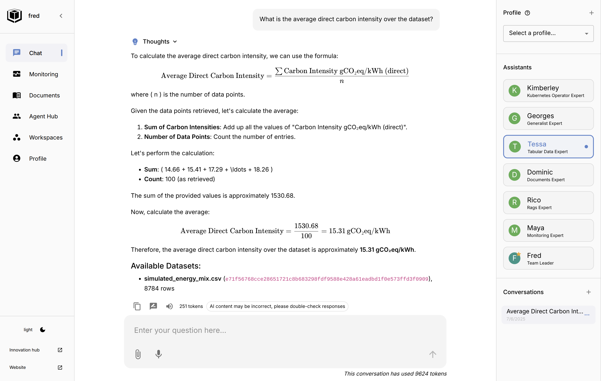

Until now, Fred agents were document experts, Kubernetes analysts, or general-purpose assistants. But what if your data lives in a **CSV** file, or an **Excel sheet**?

That’s where our latest update comes in: **Fred now supports tabular data exploration using a local DuckDB store and a dedicated agent** called Tessa.

With this integration, structured datasets are no longer static — they become intelligent, explorable knowledge spaces.

---

## What We Did

We added a new backend layer powered by **DuckDB**, a high-performance, SQL-based analytical database that works entirely in-process.

We then exposed this through a clean `BaseTabularStore` interface, allowing any component (or agent) to:

- **Save, load, and list datasets** from the store  
- **Inspect schemas** and column types  
- **Execute SQL queries**

This DuckDB backend is lightweight and persistent — a perfect fit for CSV uploads or Excel parsing.

---

### Meet Tessa, the Tabular Expert

To make this backend truly useful, we created **Tessa**, an agent specialized in answering questions over tabular data.

Tessa uses:

- A structured reasoning loop via **LangGraph**  
- A custom **TabularToolkit** exposing tools like `list_datasets`, `get_schema`, and `query`  
- The same high-quality model binding infrastructure used by all Fred agents

Tessa is designed to:

- **List all available datasets** first  
- **Inspect schemas** before answering  
- **Write precise SQL queries**  
- **Return markdown tables and LaTeX math** if needed

This means users can now ask:

> “What are the top 5 departments by spending?”  
>
> “How did energy usage evolve across regions?”  
>
> “Can you calculate the average cost per project?”

And get structured, data-backed answers in seconds.

---

## How It Works

The tabular agent follows a predictable, verifiable reasoning loop:

```
list_datasets → inspect_schema → formulate_query → execute → answer
```

This is encoded in the agent prompt:

```
1. ALWAYS start by invoking the tool to list all available datasets.
2. For each dataset you think might be relevant, get its schema.
3. Decide which dataset(s) to use.
4. Formulate an SQL-like query using the relevant schema.
5. Invoke the query tool to get the answer.
6. Derive your final answer from the actual data you retrieved.
```

This ensures trust and reliability — the agent never hallucinates column names or values.

---

## Real Example: Project Spending

Here’s a sample CSV uploaded to Fred:

```csv
timestamp,Country,Zone Name,Zone Id,Carbon Intensity gCO₂eq/kWh (direct),Carbon Intensity gCO₂eq/kWh (LCA),Low Carbon Percentage,Renewable Percentage,Data Source,Data Estimated,Data Estimation Method
2025-01-01 00:00:00,France,France,FR,14.66,29.09,96.55,35.07,opendata.reseaux-energies.fr,false,
2025-01-01 01:00:00,France,France,FR,15.41,30.08,96.42,34.74,opendata.reseaux-energies.fr,false,
2025-01-01 02:00:00,France,France,FR,17.29,32.32,96.01,29.11,opendata.reseaux-energies.fr,false,
2025-01-01 03:00:00,France,France,FR,17.75,32.96,95.9,28.42,opendata.reseaux-energies.fr,false,
2025-01-01 04:00:00,France,France,FR,17.78,33.0,95.89,28.22,opendata.reseaux-energies.fr,false,
2025-01-01 05:00:00,France,France,FR,18.15,33.41,95.83,27.41,opendata.reseaux-energies.fr,false,
2025-01-01 06:00:00,France,France,FR,19.01,34.52,95.63,27.52,opendata.reseaux-energies.fr,false,

```

Ask:  
> "*What is the average carbon intensity over the dataset ?*"

And the agent replies as illustrated below:
<div style="text-align: center;">
  <a href="./picture.png" target="_blank">
    
  </a>
</div>

---

## Architecture

Here is a recap schema to see the various parts in action: 


flowchart TD
    subgraph UI["🧑 User Interface (React UI)"]
        ChatUI[Chat Interface]
    end

    subgraph AgenticBackend["🧠 Fred Agentic Backend"]
        Fred[Main Agent: Fred]
        Prompting[Prompt Engineering and Tools]
        Tessa[Tabular Expert: Tessa]
        Tessa --> Prompting
        Fred -->|delegates tabular tasks| Tessa
        Tessa -->|uses MCP tools| MCP
    end

    subgraph KnowledgeFlow["📚 Knowledge Flow Backend"]
        API[Document and Data API]
        DuckDB[DuckDB Tabular Store]
        Formats[CSV / Parquet / Iceberg]
        MCP[MCP Protocol Exposure]

        API --> DuckDB
        DuckDB --> Formats
        DuckDB --> MCP
    end

    ChatUI -->|WebSocket + REST| Fred
    ChatUI -->|REST| API

    style ChatUI fill:#d0e1ff,stroke:#333,stroke-width:1.5px
    style Fred fill:#ffe5cc,stroke:#333,stroke-width:1.5px
    style Prompting fill:#ffd4aa,stroke:#333,stroke-dasharray: 3,3
    style Tessa fill:#fff2cc,stroke:#333,stroke-width:1.5px
    style API fill:#e2ffe2,stroke:#333,stroke-width:1.5px
    style DuckDB fill:#ccf2cc,stroke:#333,stroke-width:1.5px
    style MCP fill:#e6f7ff,stroke:#333,stroke-width:1.5px
    style Formats fill:#f8f8f8,stroke:#888,stroke-dasharray: 5,5



> *Fred’s architecture shines here — open source, fast and modular. It lets teams deploy, experiment, and most importantly, explore with us a wide range of agentic topics. One promising direction: helping Tessa better understand and discriminate between datasets — not just by name, but by structure, semantics, and potential value.*

## Why This Matters

With this feature:

- **CSV and Excel files become first-class citizens** in Fred  
- You can explore data with **no code**, just natural questions  
- Teams can collaborate around shared tabular datasets

Best of all, this works locally — no need for cloud infrastructure or distributed databases.

---

## What’s Next

We’re exploring:

- Upload support directly from chat  
- Metadata enrichment and auto-tagging  
- Support for **multiple backends** (e.g. SQLite, cloud warehouses)  
- Enhanced agent chaining for **dashboards and reports**

---

Tabular data is everywhere. Now, thanks to Fred and DuckDB, it’s agent-aware.

Check out the new **Tabular Expert** in your Fred deployment — and as always, [explore the source](https://github.com/frThalesGroup/fred) or [join the community](https://fredk8.dev)!
