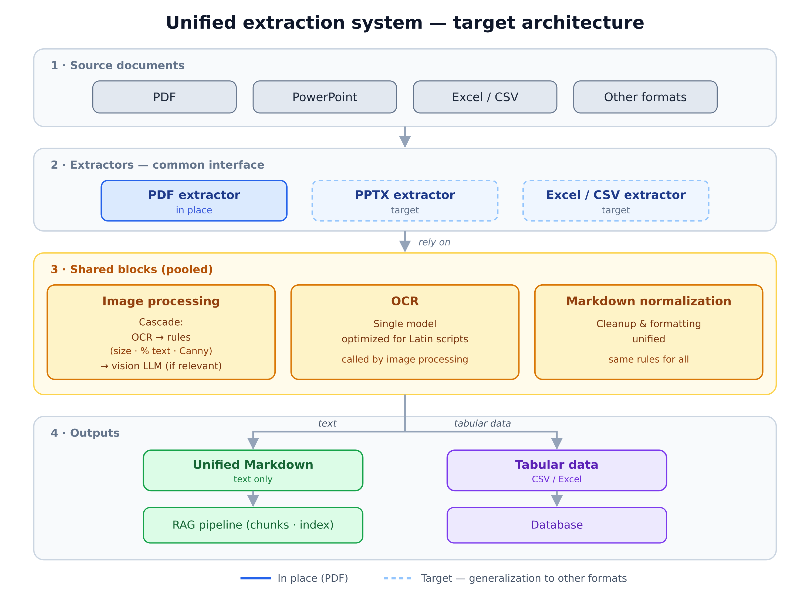

*Why we want to take the ingestion-mode decision away from the user, how we rebuilt the PDF → Markdown pipeline to make it fast, faithful, and cheap, and the unified ingestion architecture this points toward.*


This article continues [Document Ingestion Is Not a Side Effect](https://fredk8.dev/blog/document-ingestion-is-not-a-side-effect/) and [Rich Mode: Extending RAG with Direct Visual Evidence](https://fredk8.dev/blog/rich-mode-extending-rag-with-direct-visual-evidence/). The first argued a point: ingestion is a first-class architectural concern. The second showed how Rich mode lets us treat an image as evidence in its own right. This post sets a direction for what comes next: in time, if ingestion is well designed, the user shouldn't have to choose how it happens.


---

## The problem: three modes, and a choice no one wanted to make

Today, Fred exposes three ingestion modes: Fast, Standard, and Rich. On paper, it's a good idea: you give the user control over the trade-off between speed, fidelity, and cost. In practice, that choice turns out to be hard to carry — for the user and for the platform alike.

The first problem is cognitive. Choosing a mode assumes you know, ahead of time, what the document contains, how it will be used, and what level of fidelity justifies what extra cost. Very few users have that context at upload time. The choice then becomes arbitrary — or worse, systematically biased.

The second problem is operational. The performance gaps between the three modes are considerable, especially on PDFs. Fast stays light and deterministic; Standard and Rich, by contrast, can consume enormous resources and become very slow on large documents. On some files, processing exceeds ten minutes and drives the RAM of the Temporal pods high enough to threaten their stability.

The consequence is predictable: we tend to favor Fast. Not because it offers the best quality, but because it keeps the infrastructure standing. When the poorest mode becomes the de facto default — for reasons of stability rather than relevance — that's a sign the choice itself is badly framed.

The conclusion is clear: it's hard, if not impossible, to ask the user to choose correctly how a document should be ingested. So the direction we're taking is to make that choice disappear — not by documenting it better, but by making it unnecessary. This is a direction for upcoming versions, not yet a given: before we can remove the modes, we need a default pipeline good enough for every case. The first concrete step targeted the most problematic of them, PDF extraction.

---

## One goal: a pipeline acceptable for every type and size of document

Making ingestion transparent imposes a hard constraint: the default pipeline must deliver acceptable performance and controlled cost, *whatever* the type and size of the document. No fast mode to reach for when load spikes, no heavy mode reserved for precious corpora. A single path, which has to hold up on a two-page PDF as well as on a several-hundred-page guide.

That constraint is what guided the rebuild. It pushed us toward newer technological building blocks better suited to Fred's needs, and toward a simple rule: spend compute — and tokens — only where it actually changes the result.

---

## Rethinking PDF → Markdown extraction

For extracting a PDF's content, we replaced the old chain with a recent, Markdown-oriented extraction library. The goal is to get good-quality Markdown straight out of extraction: handling titles and hierarchy, rendering tables, removing recurring headers and footers. In other words, keeping the maximum of useful structure without going through a costly layout reconstruction.

As we wrote in the first post, the choice of parser isn't an implementation detail: it's an architectural decision. Here, that choice answers the previous constraint directly — extract quickly, cleanly, and predictably, across the whole spectrum of documents.

---

## A decoupled, reusable image-processing block

Extraction isn't enough. Turning a document into text surfaces, along the way, a large number of images — and they're not all worth the same. Some carry embedded text, some are *nothing but* text, others are architecture diagrams, and many are just photos or screenshots with no value for retrieval.

Until now, processing these images was tangled inside the extractors. For PDF, we pulled it out: image processing is now a standalone, standardized algorithmic block, independent of the extractor that calls it. The intention is to do the same for the other formats — PowerPoint, Excel, CSV — by extracting their image processing into this same block rather than reimplementing it in each extractor. This decoupling has an immediate benefit: you can evolve the image-processing logic once, without touching the extractors themselves, and everyone benefits.

The guiding principle is economic. Processing 100% of images correctly is illusory; the goal is to apply to each image the fastest and cheapest technique that yields a sufficient result.

### A cascade, not a systematic LLM call

Describing images with an LLM is, by far, the most expensive option. The whole job is to resort to it only for the cases that truly warrant it. The block therefore works as a cascade:

- Each image first goes through an OCR model to extract its text.
- A few triage rules then decide what happens next:
  - an image that's too small is not sent to an LLM (minimum-size threshold);
  - an image made up mostly of text doesn't need an LLM — OCR has already done the work;
  - an image whose Canny filter exceeds a certain threshold — a sign of rich visual structure, typically a diagram — can be handed to an LLM.

This logic flips the default load. Instead of sending every image to the vision model and paying for each one, we call the model only when the image holds real visual value that OCR alone doesn't capture.

### OCR: same provider, newer version

For OCR, we stayed with the same provider as before, but on a newer version, optimized for performance and execution time on Latin-script languages. At this stage, the new model is in place for PDF only; it's meant to be exported to the other extractors, in the same pooling logic as the image block. This matters: OCR is now on the critical path of *every* image, no longer an optional step. Its speed sets the pace of the whole cascade.

---

## The results

The measurements run on PDF extraction, comparing the old Rich pipeline to the new one on a sample of representative documents, all point the same way. Rather than precise figures — which depend on the document, its size, and its visual content — what matters are the trends.

- **Processing time collapses, especially on large documents.** On the heaviest files, the order of magnitude drops from several hundred seconds to a few dozen: a speedup on the order of ten, sometimes more. These are exactly the cases that, before, pushed people to flee toward Fast.
- **Memory use is divided by three to four.** The RAM needed to process a given document falls sharply, which makes the pipeline compatible with stable execution on the Temporal pods, without saturating them or bringing them down.
- **Calls to the vision model become marginal.** This is where token cost is decided: the "OCR + rules" cascade filters the vast majority of images before they ever reach an LLM. On image-heavy documents, we go from hundreds of calls to a handful — a reduction that often exceeds 90%.

One point may be surprising: instantaneous CPU is sometimes *higher* than before. That's not a defect. The new pipeline parallelizes more and finishes much faster; a higher load peak, but over a far shorter duration, amounts overall to less compute — and a much smaller window of pod occupancy.

---

## Toward a unified ingestion architecture

The PDF rebuild is only a first step. The real target is architectural: generalizing these blocks across the whole ingestion ecosystem.

*Target architecture. The PDF path is in place; generalization to the other formats (PowerPoint, Excel / CSV) is the intended direction.*

The guiding idea is that the same need should be solved only once. Today, image processing and OCR exist as standalone blocks on the PDF side; tomorrow, they should be *the only* image-processing and OCR blocks in the entire chain. A single image-processing system, a single OCR system — shared by all extractors.

The benefit is cumulative. Any improvement to the image block or the OCR model immediately benefits every format, with no need to reimplement it in each extractor. The debt is paid once; the gains propagate everywhere.

This ambition has a limit, though, and it depends as much on tooling as on architecture. Not all libraries lend themselves equally to this block-by-block decomposition. "All-in-one" extraction solutions often bundle their own image handling, their own OCR, and their own layout into a whole that can't be easily pulled apart. They then offer less flexibility to isolate a specific treatment, standardize it, and unify it with the rest of the chain. It's a real constraint: the more a block is locked inside a monolithic dependency, the less cleanly it can be pooled across extractors. The choice of tools is therefore not neutral with respect to this decomposition philosophy — it either serves it or holds it back.

### Shared treatments, owned specificities

Some formats call for particular handling. A PowerPoint, an Excel, or a CSV isn't split like a PDF: slide structure, sheets, cells, tabular relations. The target architecture doesn't erase these specificities — it isolates them. Each extractor keeps the share of logic that's its own, but leans on the common blocks for everything that can be shared: image processing, OCR, and normalization.

### Markdown as the common denominator

This is what makes unification possible. At the end of the chain, every document is represented in Markdown. This common pivot format lets us standardize part of the post-processing, regardless of the source format — particularly for textual documents. Where each extractor has so far produced its own variant, unified Markdown processing lets us apply the same cleanup and formatting rules to everyone.

Not everything reduces to text, though. For tabular formats — CSV, Excel — the stakes aren't only about getting clean Markdown, but about preserving the structure of the data. Beyond the Markdown that makes them readable by the textual chain, this data is meant to be stored in a database, to make it easier to exploit: queries, aggregations, joins. Markdown remains the common denominator for the textual part; the database takes over wherever it's structured data that matters.

### A common interface for developers

Behind all this, the goal is as human as it is technical: to offer developers a common interface for all the processors. Standardizing the behavior of each extractor means simplifying its use — and, just as important, making it testable the same way as the others. Shared blocks and a single interface are single control points: you test the image block once, OCR once, Markdown normalization once, and you trust the whole chain.

---

## Conclusion

The first post in this series argued a point: ingestion deserves first-class architectural status. The second showed how Rich mode could treat an image as evidence in its own right. This third post sets a direction: in time, if ingestion is well designed, the user shouldn't have to choose how it happens.

Removing the choice of modes won't be a surrender on quality — on the contrary, it's the condition for making quality a given. It requires a default pipeline fast, light, and cheap enough to make that choice unnecessary. The PDF extraction rebuild is the first block of this ambition; generalizing the shared blocks — image processing, OCR, Markdown normalization — and a common pivot format is the logical next step, one that will turn a set of heterogeneous extractors into a coherent ingestion chain, simpler to evolve and to test.

As with the rest of Fred, the goal isn't perfection — we'll never process 100% of images ideally. The goal is honesty about the trade-off: spend compute and tokens where they count, and nowhere else.
