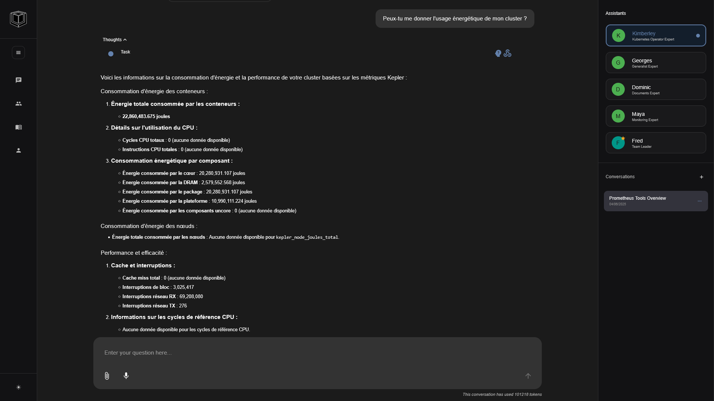
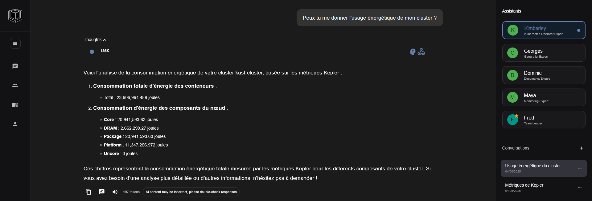
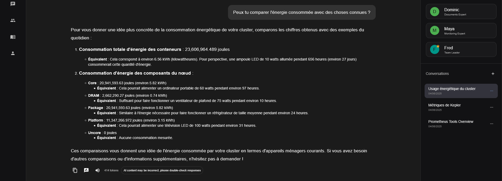

We’ve come a long way since our first [FrugalIT Inspector](https://paradox-innovation.dev/blogs/frugalit-inspector/) prototype. Back then, exploring power-aware Kubernetes required custom probes and intricate setups.

Today, things are much simpler — and far more powerful — thanks to two major evolutions:

1. The arrival of the first open-source **Prometheus MCP (Model Context Protocol)** server that standardizes metrics exposure.
2. The rapid progress of the [**Fred** open-source project](https://fredk8.dev), which now offers agentic observability out of the box.

This post showcases how these two ingredients combine to make Kubernetes power analytics both accessible and intelligent. Our setup is quite simple:

- An open-source **Prometheus MCP server**
- Kepler](https://github.com/sustainable-computing-io/kepler) for energy usage estimation
- Prometheus for metrics exposure

With this setup, Fred can now **observe and analyze energy and power consumption** across workloads and namespaces. Even better, users can pose questions like:

> “Which namespace consumed the most power this week?”
>
> “What’s the CO₂ cost of running this workload?”
>
> “Is this deployment more like a kettle or a data center?”

---

## What We Did

We deployed a lightweight MCP server to expose Kubernetes metrics in a clean, extensible way. We then deployed a kepler probe to our cluster.
Kepler estimates power usage by reading performance counters and cgroups, and **publishes metrics to Prometheus**.

These include:

- `kepler_container_joules_total`
- `kepler_node_power_watt`
- `kepler_container_package_joules_total`


### Designing a New MCP Agent: Kimberley

As part of this integration, we also designed a new Kubernetes agent called **Kimberley**, built using the Fred agent framework. Kimberley leverages our MCP setup to actively reason about metrics and provide actionable insights.

This agent is not just reactive — it's proactive. It can:

- Use tools to query **real-time energy metrics** from Prometheus and MCP
- Analyze power usage per **namespace, pod, or container**
- Detect anomalies or inefficiencies in energy usage
- Translate technical data into **human-friendly summaries** and real-world equivalents

Here’s what makes Kimberley special:

- It uses a custom `K8SOperatorToolkit` bound to the agent's LLM.
- It follows a structured reasoning loop: fetch → analyze → respond.
- It’s tightly integrated with MCP, Kepler, and Prometheus.

> Internally, Kimberley is implemented as a `LangGraph` agent with a reasoning loop and tool support. Its prompt instructs it to always fetch data before answering, ensuring responses are grounded in live metrics.

For example, the agent is initialized with:

```python
self.toolkit = K8SOperatorToolkit(self.mcp_client)
self.model_with_tools = self.model.bind_tools(self.toolkit.get_tools())
self.llm = self.model_with_tools
```

Which gets its configuration via:

```yaml
    - name: K8SOperatorExpert
      class_path: "agents.kubernetes_monitoring.k8s_operator_expert.K8SOperatorExpert"
      enabled: false
      mcp_servers:
        - name: k8s-mcp-server
          transport: sse
          url: http://localhost:8081/sse # Run the k8s mcp server via docker compose
          sse_read_timeout: 600 # 10 minutes. It is 5 minutes by default but it is too short.
        #######################################
        #### Example using STDIO transport ####
        #######################################
  agents:
    - name: K8SOperatorExpert
      class_path: "agents.kubernetes_monitoring.k8s_operator_expert.K8SOperatorExpert"
      enabled: false
      mcp_servers:
        - name: prometheus-mcp-server
          transport: stdio
          command: uv
          args:
            - "--directory"
            - "/home/xxx/Documents/github_repos/prometheus-mcp-server"
            -  "run"
            -  "src/prometheus_mcp_server/main.py"
          env: 
            PROMETHEUS_URL: "http://localhost:9091"
      model: {}
```

With the Toolkit being the list of tools published via the MCP server.

This allows the agent to run tools like:
- Fetching container or pod-level kepler_container_joules_total
- Aggregating energy per namespace
- Returning summaries like "This deployment consumes energy equivalent to 3 electric kettles."

By combining LangGraph’s structured control flow with real-time Prometheus metrics, Kimberley becomes a true observability expert for Kubernetes environments.

---

## Visualizing the Data

Here are three real screenshots from our setup:

### 1. Cluster-Wide Power Consumption

<a href="./consommation-cluster.png" target="_blank">
  
</a>

### 2. Namespace-Level Joules Over Time

<a href="./consommation-usage.png" target="_blank">
  
</a>

### 3. Workload Comparison with Real-World Examples

<a href="./consommation-comparaison.png" target="_blank">
  
</a>


---

## Why This Matters

Energy is becoming a first-class concern in software systems.

With this integration:

- Agents can reason about consumption
- Users can observe trends over time
- We bring sustainability awareness directly into Kubernetes operations

---

## What’s Next

We’re working on:

- Allowing agents to **generate sustainability reports**
- Building policies to **alert on high-energy workloads**
- Integrating **CO₂ estimators** to contextualize energy use

---

Fred continues to evolve — and now, it’s energy-aware.

Stay tuned — and as always, [check out the code](https://github.com/fred-agent) or [join the discussion](https://fredk8.dev)!

