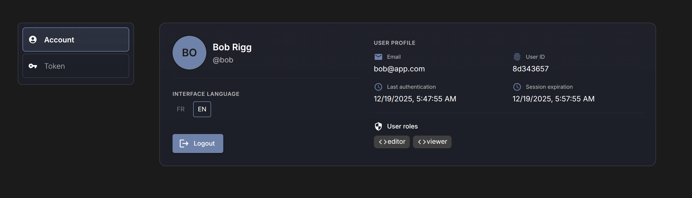
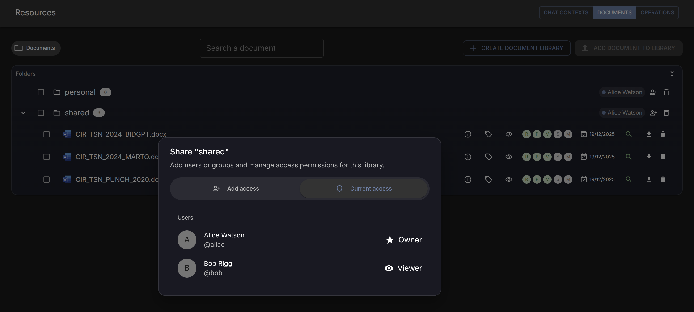
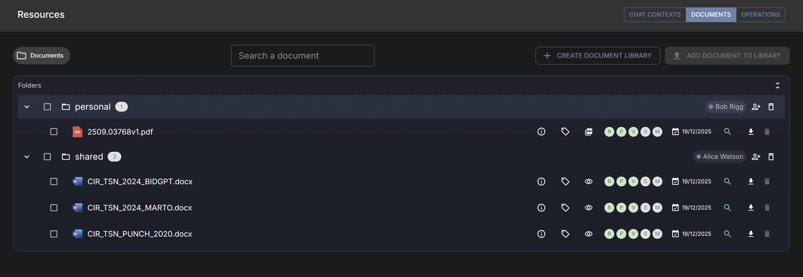
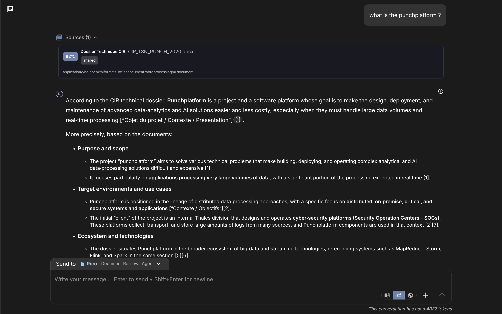

The resource layer in Fred acts as a centralized control plane for prompts, document sets, and chat contexts. As these resources scale across an organization, providing secure access becomes a challenge of managing complex hierarchies. To address this, Fred utilizes a Relationship-Based Access Control (ReBAC) model powered by OpenFGA, implementing a system where permissions are not just assigned, but inherited through the natural structure of the data.

## The Evolution from Roles to Relationships

In traditional authorization systems, Role-Based Access Control (RBAC) often proves too rigid for modern collaborative environments. While assigning a "Viewer" or "Editor" role to a user is straightforward, it becomes computationally expensive and administratively difficult to manage when permissions must cascade through nested tags or specific document libraries. Similarly, Attribute-Based Access Control (ABAC) offers high flexibility but frequently results in "policy sprawl," where logic becomes fragmented across various boolean conditions.

ReBAC offers a more scientific approach by modeling authorization as a directed graph. In this model, access is determined by the existence of a relationship path between a subject and an object. For Fred, this means that if a user has an "owner" relationship with a parent tag, the system automatically resolves their access to any documents linked to that tag via a "parent" relationship. This approach mirrors the familiar semantics of file system sharing while maintaining the performance required for agentic workflows.


flowchart LR
  User["👤 User / Subject"]
  Group["👥 Keycloak Group"]
  TagP["📂 Parent Tag (Folder)"]
  TagC["📁 Child Tag"]
  Doc["📄 Document / Resource"]

  User -- "member_of" --> Group
  Group -- "owner/viewer" --> TagP
  TagP -- "parent_of" --> TagC
  TagC -- "parent_of" --> Doc

  style User fill:#f9f9f9,stroke:#333
  style TagP fill:#e1f5fe,stroke:#01579b
  style Doc fill:#fff3e0,stroke:#e65100


The diagram above illustrates the directed acyclic graph (DAG) structure that OpenFGA traverses to resolve access. In this model, permissions are resolved through a chain of associations: a user’s identity is linked to a group, which in turn holds a defined relationship to a high-level container (Parent Tag). Because the system recognizes the 'parent_of' relation between tags and documents, any permission granted at the top of the chain automatically propagates downward. This eliminates the need to explicitly assign permissions to every individual document, as the authorization engine calculates the valid path from the User to the Document at the moment of the request.

## Architecture: OpenFGA and the Logic of Tuples

Fred externalizes its authorization logic to OpenFGA, a Zanzibar-inspired system that stores access rules as relationship tuples. A tuple is a discrete unit of data represented as `object#relation@user`. For example, `tag:engineering#viewer@group:dev-team` signifies that any member of the development team inherits viewing rights to the engineering tag.

This architecture allows Fred to decouple identity from access logic. While Keycloak remains the single source of truth for identity and group membership, OpenFGA manages the graph of how those identities relate to specific resources. When an authorization check occurs, the system does not simply look for a static flag; it traverses the relationship graph to find a valid path from the user to the requested resource.

Here is how it concretely works: When Bob shares a folder with Bill, the interaction follows a structured path through the system architecture:

1.  **Identity (Keycloak):** Bill is authenticated and identified as a member of a specific team or group.
2.  **Knowledge Flow Backend:** This layer manages the ingestion and storage of documents and tags. When Bob grants access, Knowledge Flow records the intent and updates the relationship graph in OpenFGA.
3.  **Authorization Layer (OpenFGA):** The authoritative store for relationship tuples. It calculates in real-time whether Bill's group membership grants him access to a nested document.
4.  **Agentic Backend:** When Bill runs an agent, the backend requests resources from Knowledge Flow. Knowledge Flow then performs a "Check" against OpenFGA before releasing any data.


flowchart LR
  UI["🖥️ React UI\n(Bob shares folder)"]
  KC["🔐 Keycloak\n(Identity/Groups)"]
  
  subgraph Backends["Fred Ecosystem"]
    Agentic["🧠 Agentic Backend\n(Runs Agents)"]
    KF["📚 Knowledge Flow\n(Docs & Storage)"]
  end
  
  FGA["🛡️ OpenFGA\n(Relationship Graph)"]

  UI --> KF
  KC -.-> FGA
  Agentic --> KF
  KF <--> FGA

  style FGA fill:#f0f4ff,stroke:#0052cc,stroke-width:2px
  style KF fill:#f0fff0,stroke:#00cc00
  style Agentic fill:#fff7e6,stroke:#7A4A21
   

The architectural flow demonstrates the separation of concerns between state management and policy enforcement. In this scenario, the Knowledge Flow backend acts as the gatekeeper; it does not store the permission logic itself but queries OpenFGA to validate the relationship between the requester and the resource. This ensures that the Agentic Backend only processes data that has been explicitly authorized, maintaining a secure "chain of trust" from the UI down to the storage layer.

## Advanced Implementation

The integration between the Python `RebacEngine` and the OpenFGA schema introduces three specific mechanisms that ensure the system is both reactive and strictly consistent.

### 1. Contextual Tuples and Identity Decoupling
Rather than synchronizing every Keycloak group membership change into the OpenFGA database—which can lead to race conditions—Fred uses **Contextual Tuples**. When a   permission check is performed, the engine retrieves the user's current group list from Keycloak and sends it as part of the request payload. These "in-flight" relations exist only for the duration of that specific check, ensuring that authorization decisions are always based on the most up-to-date identity state.

### 2. Group Path Recursion
Organizational groups are often hierarchical (e.g., `/engineering/dev/backend`). The engine's `_iterate_on_parent_child_path` logic decomposes these paths into individual parent-child relationship edges. This allows the OpenFGA schema to resolve access for a user in a sub-group by traversing upward to a parent group that was granted access to a resource, effectively mirroring the organizational structure within the authorization graph.

### 3. State Consistency with Tokens
To handle the distributed nature of the backend, the `RebacEngine` utilizes a `consistency_token`. When a relationship is modified (e.g., Bob grants Bill access), OpenFGA returns a token representing the new state of the graph. By passing this token back in subsequent checks, Fred guarantees "read-after-write" consistency. This prevents the "newly-shared resource not found" error that often occurs in eventually consistent systems.

## Permission Propagation and Enforcement

The implementation of ReBAC in Fred follows a consistent lifecycle for every resource. Upon the creation of a tag or document, the backend writes an ownership tuple to OpenFGA. If the resource is created within an existing hierarchy, a `parent` relation is established. This link acts as a bridge for permission inheritance. When a user attempts to read, update, or delete a resource, the application invokes a centralized check. This process evaluates the user’s direct permissions alongside any permissions inherited through group memberships or parent-child relationships.

Because group memberships are treated as subjects within the graph, changes in Keycloak reflect instantly in Fred. If a user is removed from a group, the relationship path to the resource is broken, and access is revoked without requiring a manual synchronization of the database or a re-indexing of permissions.

## Practical Implications for Scalability

Centralizing authorization through relationship graphs provides a high degree of auditability and precision. Administrators can query the system to determine exactly why a user has access to a specific document, identifying the specific chain of inheritance or group membership that granted the permission. This model maintains the principle of least privilege, ensuring that users and agents only interact with the data necessary for their specific tasks, even as the volume of vectorized documents and prompt libraries grows into the millions.

By shifting to a ReBAC model, Fred ensures that its security infrastructure is as dynamic as the agentic workflows it supports, providing a robust, scalable, and mathematically sound foundation for resource management.    

# ReBAC in action

Here is a typical scenario. Each user has a profile and set of roles defined in Keycloak. For example, here is a view of Bob's profile:

<figure style="text-align: center; margin-bottom: 2.5rem;"> 
   
 <figcaption style="margin-top: 0.8rem; font-style: italic; color: #666; font-size: 0.9em;"> Figure 1: Bob's identity and group memberships managed within Keycloak. </figcaption> </figure>

Another user, Alice, shared her 'shared' folder with Bob:

<figure style="text-align: center; margin-bottom: 2.5rem;"> 
   
 <figcaption style="margin-top: 0.8rem; font-style: italic; color: #666; font-size: 0.9em;"> Figure 2: Alice granting access permissions to Bob through the Fred UI. </figcaption> </figure>

As a result, Bob now sees the corresponding folder in his UI. Notice the owner identity indicated on the right side of each folder; this helps users track resource ownership at a glance:

<figure style="text-align: center; margin-bottom: 2.5rem;"> 
   
 <figcaption style="margin-top: 0.8rem; font-style: italic; color: #666; font-size: 0.9em;"> Figure 3: Bob’s resource view showing inherited access from Alice. </figcaption> </figure>

With this sharing in place, if Bob utilizes a RAG agent to query the shared library, the agent is authorized to retrieve the relevant context:

<figure style="text-align: center; margin-bottom: 2.5rem;"> 
    
 <figcaption style="margin-top: 0.8rem; font-style: italic; color: #666; font-size: 0.9em;"> Figure 4: A RAG agent successfully questioning the shared document library. </figcaption> </figure>

## References & Further Reading

For those interested in exploring the underlying technologies and the "Zanzibar" philosophy that powers Fred's authorization layer, the following resources provide deep technical insights:

* [OpenFGA Documentation](https://openfga.dev/docs): The official guide to the OpenFGA API, configuration, and relationship modeling.
* [Google’s Zanzibar Paper](https://research.google/pubs/pub48190/): The foundational research paper describing the global, scalable authorization system that inspired OpenFGA.
* [Keycloak Authorization Services](https://www.keycloak.org/docs/latest/authorization_services/): Documentation on managing identities and how Fred leverages Keycloak as the source of truth for group memberships.
* [FGA Relationship Modeling Lab](https://openfga.dev/docs/modeling): A practical playground to test and visualize relationship-based models like the one used in Fred.
* [CNCF Cloud Native Security](https://www.cncf.io/blog/2025/11/11/openfga-becomes-a-cncf-incubating-project/): An overview of why OpenFGA was accepted into the Cloud Native Computing Foundation and its role in modern security.