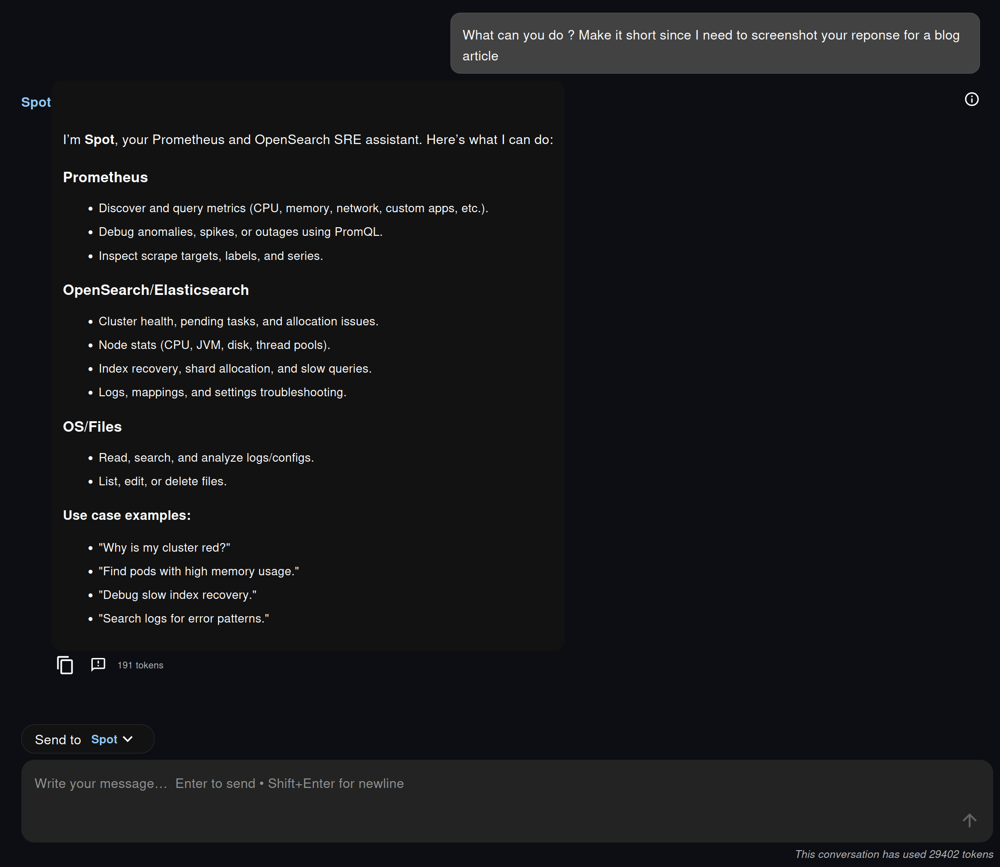
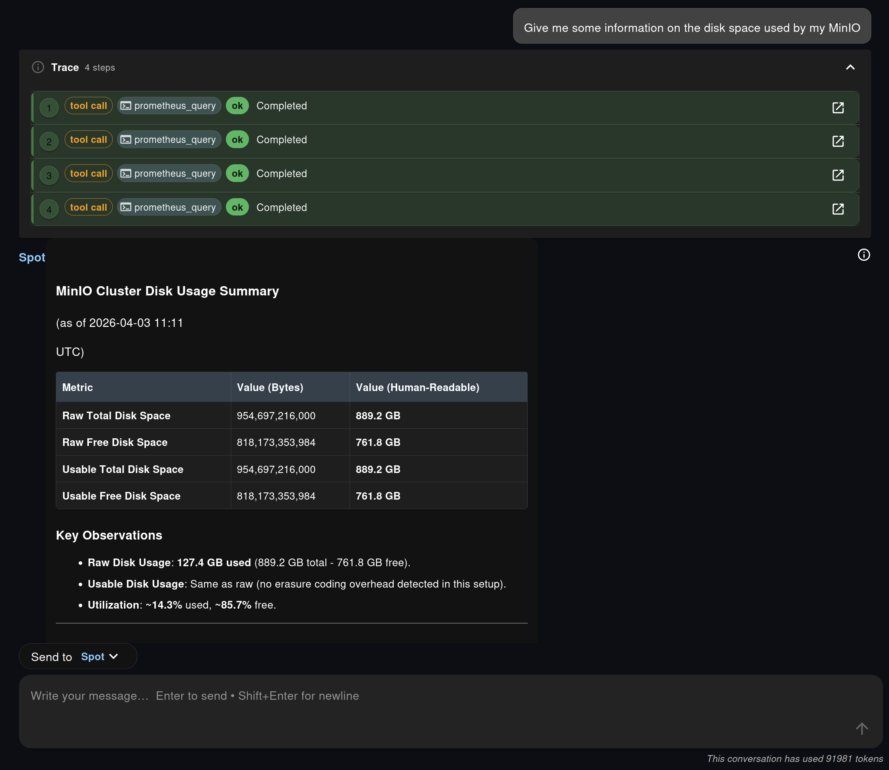
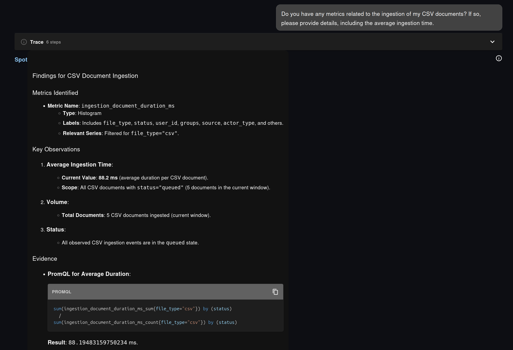
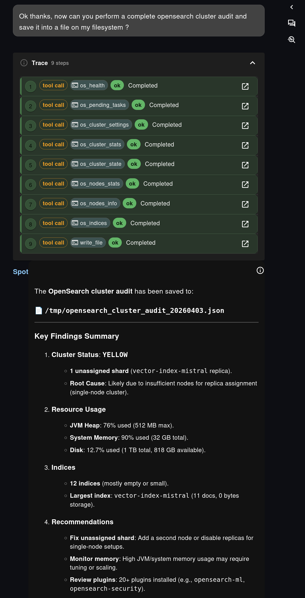
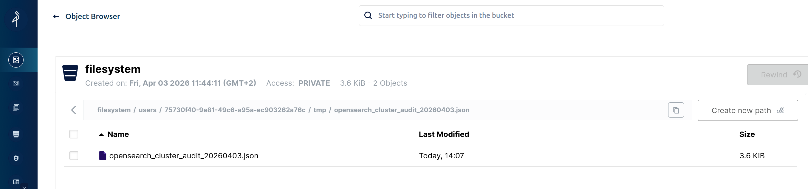
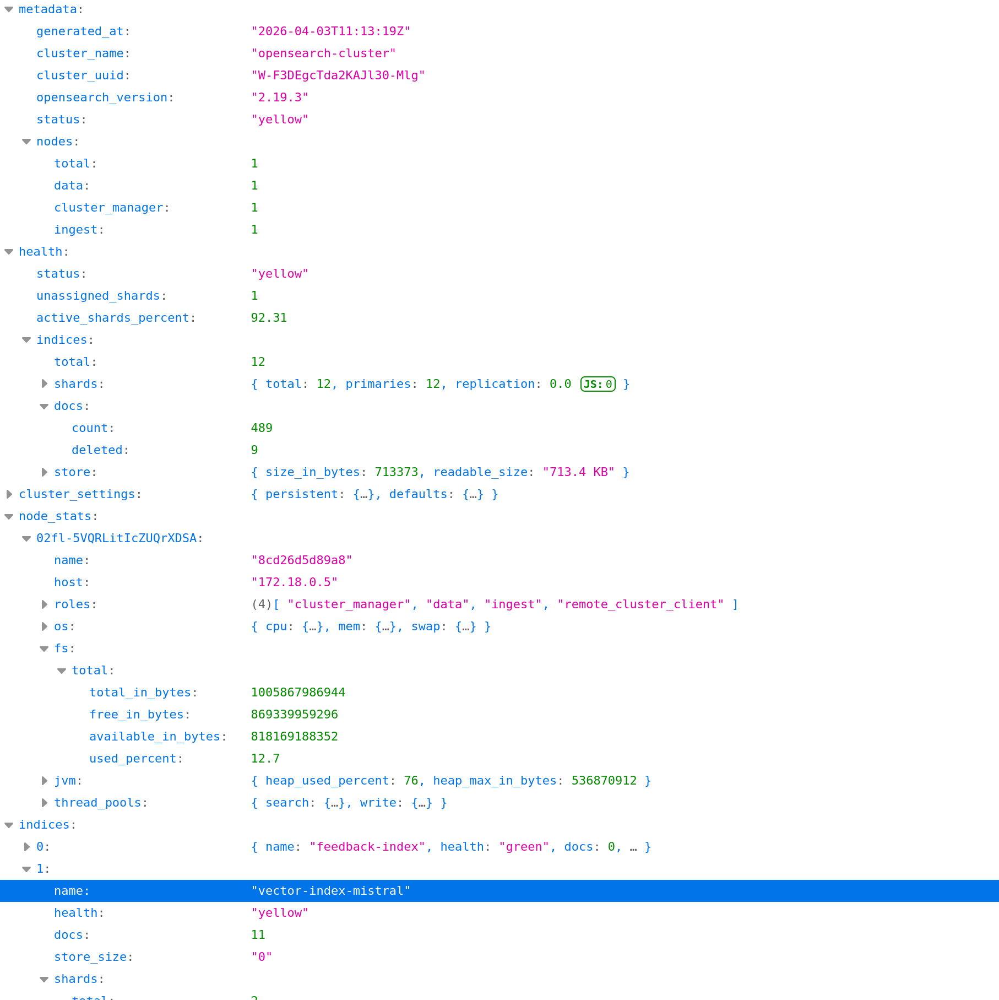

Observability in Fred is not an afterthought. It is part of the platform design.

Dashboards still matter. Grafana remains an excellent place for shared views, alerting, and long-lived operational panels. But in day-to-day operations, teams also need something more immediate: the ability to ask a question in plain language, on the fly, about their own workload, their own namespace, or their own cluster state, without first building a dedicated dashboard.

That is exactly the role of **Spot**, a monitoring-focused agent backed by **MCP tools exposed by knowledge-flow**. With Spot, Fred gains a conversational observability layer on top of **Prometheus** for metrics and **OpenSearch** for search and cluster diagnostics, while keeping a strong operational principle: answers must stay grounded in actual tools, actual queries, and actual persisted results.

---

## Spot Starts by Exposing Its Real Capabilities

One of the most interesting parts of the example is the first interaction: asking Spot what it can do.

Instead of pretending to be a generic assistant with vague powers, Spot explicitly presents the capabilities made available to it through MCP. In the screenshots, this means a short list grouped around three domains:

- **Prometheus**, to discover metrics, labels, series, and investigate issues with PromQL
- **OpenSearch**, to inspect cluster health, node statistics, shard allocation, recovery, logs, and index-level issues
- **OS/Files**, to read and write files, which becomes essential for saving reports and handing results over to later workflows

This is important for two reasons.

First, the agent is transparent about its execution surface. The user knows what it can really inspect. Second, these capabilities are not hardcoded in the chat UI. They are **published by knowledge-flow via MCP**, then consumed by the agent runtime. In other words, the chat experience is conversational, but the architecture remains modular and explicit.

The visible tool trace in Fred reinforces that design choice. We do not just get an answer. We can also see which tools were invoked and whether they completed successfully.

<figure>
  <a href="./spot-tools-overview.png" target="_blank">
    
  </a>
  <figcaption>Spot starts by exposing the real capabilities it can access through MCP: Prometheus, OpenSearch, and filesystem operations.</figcaption>
</figure>

---

## What the Prometheus MCP Integration Adds

On the Prometheus side, the key change is the introduction of both the **Spot** agent and the corresponding **knowledge-flow Prometheus MCP endpoints**.

At a high level, this integration adds four pieces that matter in practice:

1. A dedicated Prometheus expert agent in the agentic backend, exposed as **Spot**
2. A new Prometheus operations surface in knowledge-flow, mounted as an MCP server
3. A read-only set of Prometheus endpoints for discovery and querying
4. Guardrails that force the agent to work from exact metric names rather than invented PromQL

This last point is particularly important. Spot is not prompted to improvise. Its workflow is intentionally discovery-first, and a realistic view of its potential reasoning is directly shaped by the actual Prometheus tools exposed by knowledge-flow:


flowchart TD
    A[User question] --> B[Reason on the goal<br/>and the latest observation]
    B --> C{Choose next tool call}

    C --> D[Discover metrics<br/>prometheus_metrics<br/>prometheus_metrics_catalog<br/>prometheus_metadata]
    C --> E[Refine scope<br/>prometheus_labels<br/>prometheus_label_values<br/>prometheus_series]
    C --> F[Check scrape health<br/>prometheus_targets]
    C --> G[Run PromQL<br/>prometheus_query<br/>prometheus_query_range]

    D --> H[Observe tool result]
    E --> H
    F --> H
    G --> I{Query result usable?}

    I -- No --> J[Reformulate the query<br/>change labels, time window, step,<br/>aggregation, or instant/range mode]
    J --> B
    I -- Yes --> H

    H --> K{Enough evidence to answer?}
    K -- No --> B
    K -- Yes --> L[Return findings<br/>with the exact PromQL used]

    style A fill:#e3f2fd,stroke:#1565c0,stroke-width:1.5px,color:#000
    style B fill:#f5f5f5,stroke:#9e9e9e,stroke-width:1.5px,color:#000
    style C fill:#f5f5f5,stroke:#9e9e9e,stroke-width:1.5px,color:#000
    style D fill:#fff3e0,stroke:#ef6c00,stroke-width:1.5px,color:#000
    style E fill:#fff3e0,stroke:#ef6c00,stroke-width:1.5px,color:#000
    style F fill:#fff3e0,stroke:#ef6c00,stroke-width:1.5px,color:#000
    style G fill:#e8f5e9,stroke:#2e7d32,stroke-width:1.5px,color:#000
    style H fill:#f5f5f5,stroke:#9e9e9e,stroke-width:1.5px,color:#000
    style I fill:#f5f5f5,stroke:#9e9e9e,stroke-width:1.5px,color:#000
    style J fill:#fff3e0,stroke:#ef6c00,stroke-width:1.5px,color:#000
    style K fill:#f5f5f5,stroke:#9e9e9e,stroke-width:1.5px,color:#000
    style L fill:#e8f5e9,stroke:#2e7d32,stroke-width:1.5px,color:#000


That design is more than prompt engineering polish. It is a concrete way to make natural-language monitoring safer. In practice, Spot behaves like a small **ReAct loop over MCP tools**: it reasons, selects a tool, observes the result, then decides whether it has enough evidence or whether it should continue. When a PromQL query comes back empty, noisy, or poorly scoped, it can iterate by reformulating the query and adjusting parameters before answering.

On the knowledge-flow side, the Prometheus MCP surface is also broad enough to be genuinely useful. It exposes endpoints and tools for:

- instant queries and ranged queries
- metric name discovery
- compact metric catalogs enriched with metadata
- metric metadata lookup
- series discovery
- label and label-value exploration
- scrape target inspection

Configuration stays straightforward:

```yaml
integrations:
  prometheus:
    base_url: http://localhost:9090
    verify_ssl: false
    timeout_seconds: 15.0

mcp:
  prometheus_ops_enabled: true
```

The integration also supports optional authentication through environment variables such as `PROMETHEUS_PASSWORD` and `PROMETHEUS_BEARER_TOKEN`, which keeps credentials on the backend side rather than inside the agent prompt.

---

## From Natural Language to Exact PromQL

The most compelling aspect is not that Spot can call a metrics API. It is that it turns a natural-language monitoring question into a disciplined investigation.

In the screenshot sequence, the user asks for information about **disk space used by MinIO**. Spot does not jump directly to a guessed answer. It calls several Prometheus tools, runs multiple queries, and then returns a structured summary with raw values, human-readable sizes, and utilization ratios.

<figure>
  <a href="./spot-minio-disk-usage.png" target="_blank">
    
  </a>
  <figcaption>A natural-language question about MinIO becomes a multi-step Prometheus investigation grounded in actual metric queries.</figcaption>
</figure>

The same approach also appears in the application-level example from the chat exchange, where Spot investigates **CSV document ingestion** on the same plateform it is running on, i.e. Fred. Spot first identifies the relevant metric family, then derives the appropriate PromQL to compute an average duration instead of guessing a formula.

<figure>
  <a href="./spot-csv-ingestion-promql.png" target="_blank">
    
  </a>
  <figcaption>Spot does not just answer. It discovers the metric, derives the query, and shows the exact PromQL used for the analysis.</figcaption>
</figure>

This is the practical difference between "chatting about monitoring" and **doing observability work through language**:

- the question starts in plain language
- the agent explores the metric surface available in the cluster
- the final answer remains grounded in real Prometheus data
- the exact PromQL is made visible to the user

That last point matters a lot. It means the answer is inspectable, teachable, and reusable. A platform engineer can start from a conversational request, get a working PromQL query back, and then paste it into Grafana, an alert rule, a runbook, or a recording rule if needed.

Another thing that is possible and will most likely be integrated in Fred soon is the ability to generate Grafana dashboards on the fly (which boils down to generating plain JSON based on the identified metrics gathered by the MCP endpoints) and display them in the Chat.

This is where Fred's design becomes especially interesting. **Grafana is still useful and still necessary**, but Spot covers another category of needs:

- one-off questions that do not deserve a full dashboard yet
- personalized investigations scoped to a specific user concern
- rapid metric discovery when the metric name is not already known
- ad hoc analysis for operators who think in symptoms rather than in predefined panels

The result is an observability experience that feels lighter for the user without becoming less rigorous.

---

## OpenSearch Audits with Real Tool Chaining

The second part of the exchange shifts from Prometheus to **OpenSearch**, and this is where Spot shows another valuable property: it can orchestrate a larger diagnostic workflow instead of answering a single query.

In the screenshots, the user asks for a **complete OpenSearch cluster audit** and requests that the result be saved into a file on the agent filesystem.

Spot responds by chaining several OpenSearch MCP tools, including:

- `os_health`
- `os_pending_tasks`
- `os_cluster_settings`
- `os_cluster_stats`
- `os_cluster_state`
- `os_nodes_stats`
- `os_nodes_info`
- `os_indices`
- `write_file`

This is exactly the kind of workflow where an agent adds value beyond a dashboard. A dashboard can show a health status. Spot can collect multiple pieces of evidence, synthesize them into a report, explain likely root causes, and produce a structured artifact at the end of the process.

The screenshots illustrate that nicely:

- the tool trace shows the audit is not a black box
- the summary highlights the cluster state, resource usage, and index-level observations
- the output is written as JSON, ready to be downloaded, shared, or reused

<figure>
  <a href="./spot-opensearch-audit-trace.png" target="_blank">
    
  </a>
  <figcaption>For OpenSearch, Spot chains several MCP tools to produce a complete audit instead of a single isolated answer.</figcaption>
</figure>

OpenSearch is not the main focus of this article, but it is worth stressing that the pattern is the same as with Prometheus: **knowledge-flow exposes operational capabilities over MCP, and the agent composes them into a user-facing investigation flow**.

---

## Filesystem Persistence Changes the Nature of the Result

One of the strongest aspects of this staged interaction is not the query itself. It is what happens **after** the answer.

The OpenSearch audit is saved to a file such as `/tmp/opensearch_cluster_audit_20260403.json`, and the corresponding screenshot shows that file later retrieved from the Fred filesystem browser. In this setup, that filesystem is backed by **MinIO**, so the result is no longer an ephemeral chat message. It becomes a durable artifact.

<figure>
  <a href="./spot-opensearch-filesystem-browser.png" target="_blank">
    
  </a>
  <figcaption>The report survives the conversation: once written to the filesystem, it becomes a durable artifact that can be downloaded, reused by any other agent, or archived.</figcaption>
</figure>

<figure>
  <a href="./spot-opensearch-report-json.png" target="_blank">
    
  </a>
  <figcaption>The saved report is not just a filename. It is a structured JSON artifact containing cluster metadata, health, node stats, and index-level findings.</figcaption>
</figure>

This is a major operational improvement.

In many AI chat scenarios, the model answers well, but the output disappears into the chat history. Here, the output can be:

- stored for later review
- downloaded as JSON or any file format the user wishes for
- attached to an incident workflow
- reused by another agent
- kept as a long-term technical report or audit trail

This filesystem dimension is easy to underestimate, but it is what turns conversational analysis into something closer to real operational work. Fred is not just answering questions. It is producing **persistent observability artifacts**.

That matters for postmortems, periodic audits, compliance-oriented evidence collection, and simple day-to-day team collaboration. A teammate does not need to replay the whole conversation to benefit from the result. The report already exists as a file.

---

## Why This Matters for Fred

This example says something important about the direction of the platform.

Fred is not building observability as a bolt-on assistant next to the real monitoring stack. It is building observability **by design**:

- metrics are exposed through explicit operational interfaces
- agents can discover and use those interfaces through MCP
- the UI shows the execution trace
- answers remain grounded in real tools and real queries
- outputs can be persisted in the filesystem for long-term use

That creates a useful complement to established tools such as Grafana and OpenSearch Dashboards. Shared dashboards remain essential. But now users also get a **personal, conversational, evidence-backed analysis layer** that can adapt in real time to the question they actually have.

With Spot, the workflow becomes simple and powerful:

1. Ask a question in natural language
2. Let the agent discover the right metrics or operational APIs
3. Inspect the generated query or audit trace
4. Save the result as a durable artifact when it matters

For Prometheus, that means faster access to metrics and PromQL without sacrificing rigor. For OpenSearch, it means multi-step audits that end in a concrete report. And for Fred as a whole, it means observability is no longer limited to dashboards. It becomes something interactive, composable, and persistent.
