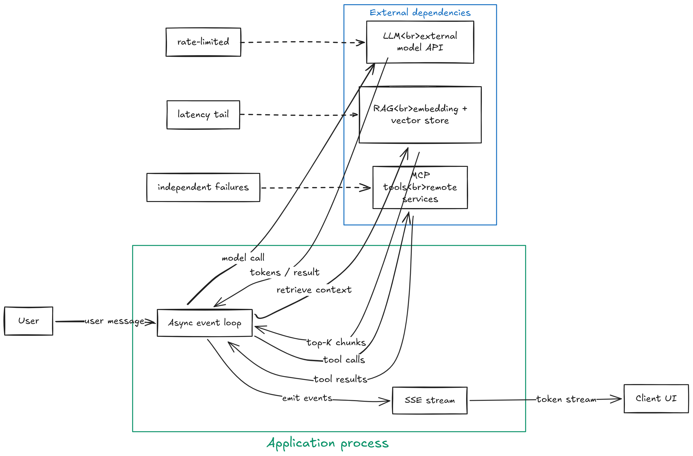
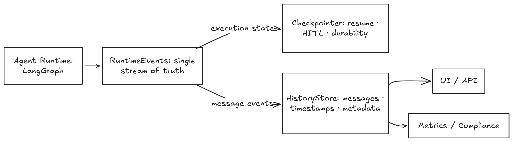
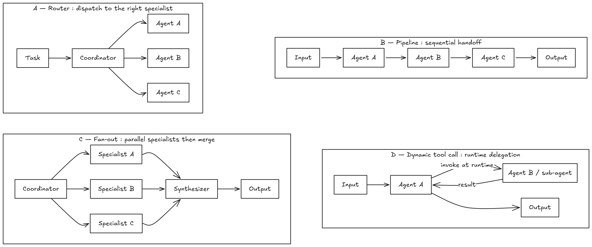
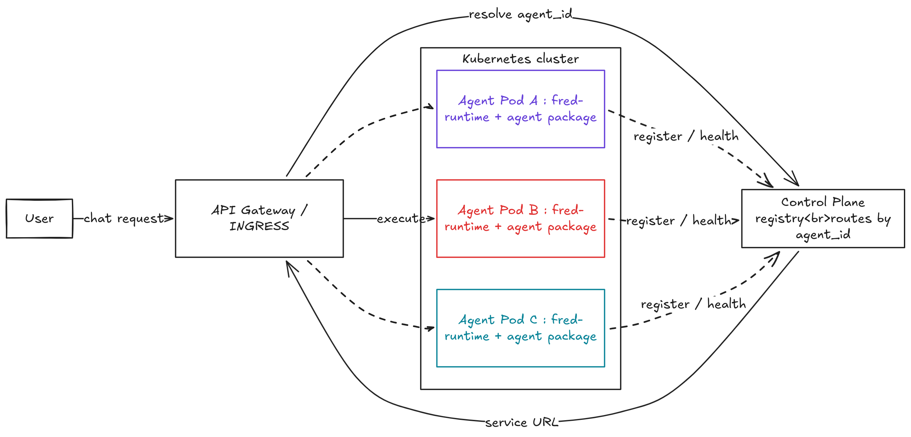
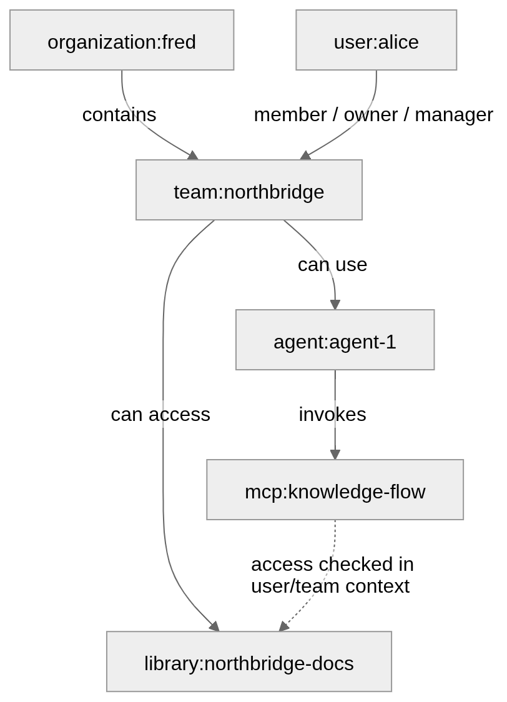

<!-- _class: title -->
<!-- _paginate: false -->
<!-- _header: '' -->

# Building Agentic Apps: Part I
## From 5-Minute Demo to Industrial Reality

### The gap nobody warns you about

<br>

<small>Dimitri Tombroff &nbsp;·&nbsp; April 2025</small>
<small>Technical Direction &nbsp;·&nbsp; Thales Service Numériques</small>
<small>[Fred](https://fredk8.dev) Lead Architect</small>


---

# What This Talk Covers

- **Part 1** — The deceptive start: a simple agent that is already a distributed system
- **Part 2** — Async by nature: the right transport model
- **Part 3** — When Execution Must Survive
- **Part 4** — Checkpointing, conversation history & Human-in-the-Loop
- **Part 5** — Security: not an afterthought
- **Part 6** — Scalability & cost
- **Part 7** — The multi-agent problem
- **Part 8** — Configuration & policy complexity
- **Part 9** — Packaging & deployment
- **Part 10** — Observability
- **Part 11** — Ecosystem landscape & Fred positioning

---

<!-- _class: section-divider -->

# Part 1
## "It Starts So Simple"

---

# The 5-Minute Agent

```python
response = llm.invoke([
    SystemMessage("You are a helpful assistant."),
    HumanMessage(user_input)
])
print(response.content)
```

- One model call, one function, zero infrastructure
- Works from a laptop with a single API key
- The demo is impressive — the audience applauds
- **"Let's put this in production."**

<br>

> Every agentic project begins here. The complexity that follows is not optional — it is the consequence of real requirements.

---

# First Real Requirement: Knowledge

> "Our agent must answer from *our* documents, not its training data."

The innocent addition:

1. Embed the user query → vector
2. Search the vector store → top-K chunks
3. Rerank results → inject into context
4. Generate with grounded context

**What just happened:**
- **Two new network hops** — embedding model, vector store
- **Latency variance**: 80 ms → 2 s depending on index load
- **New failure modes**: retrieval timeout, empty results, hallucination on weak matches
- **New cost**: embedding call + vector search per turn

---

# Second Real Requirement: Tools

> "Our agent must *do* things, not just answer."

Adding MCP tools: filesystem · web search · CRM · calendar · code runner

```
User message
  → LLM decides: "I need to call the CRM tool"
    → tool call: GET /crm/contacts?name=Alice       (network I/O, 200ms)
    → LLM processes result: "I need more info"
      → tool call: GET /crm/deals?contact_id=123    (network I/O, 350ms)
  → LLM synthesizes final answer
→ Stream to user
```

**One user turn = multiple tool round-trips**
Each call is remote, rate-limited, and can fail independently.
Tool errors must produce a sensible response, not a stack trace.

---

# What You Actually Built

### The "simple" agent is already a distributed system



---

<!-- _class: section-divider -->

# Part 2
## Async by Nature

---

# The Execution Model

Every external call is **I/O-bound and unpredictable**

| Call | Typical latency | Tail latency |
|---|---|---|
| LLM (first token) | 300 ms | 3 s+ |
| RAG retrieval | 80 ms | 2 s |
| MCP tool (simple) | 50 ms | 5 s |
| MCP tool (complex) | 1 s | 30 s+ |

- Sequential `await` compounds latency — parallel fan-out is necessary
- Token streaming is **continuous** — the client reads while the agent thinks
- The application is always **waiting on someone else's infrastructure**

---

# What Breaks When You Ignore This

- **Request timeouts** at the HTTP layer — agent still thinking, connection dead
- **WebSocket fragility** — nginx upgrade headers, K8s ingress annotations, load balancer timeouts
- **Token stream dropped mid-answer** — user sees partial response, no way to resume
- **No reconnect semantics** — page refresh loses all context
- **Sticky sessions required** — horizontal scaling becomes painful

<br>

> **Fred's lesson:** WebSocket *felt* natural for streaming but was the wrong default.
> Every layer of infrastructure needed special configuration.
> The class of bugs it caused triggered the transport reform RFC.

---

# The Right Transport Model

Replace WebSocket with <span class="highlight">HTTP Streaming (SSE)</span>

```
POST /agents/execute/stream
Authorization: Bearer <token>
Content-Type: application/json

← HTTP 200  Content-Type: text/event-stream

data: {"type": "token",      "content": "The answer is"}
data: {"type": "tool_start", "tool": "crm_lookup"}
data: {"type": "token",      "content": " 42."}
data: {"type": "final",      "session_id": "abc123"}
```

- Any reverse proxy handles this without special config (nginx, K8s ingress, CDN)
- Standard `Authorization: Bearer` header — no token-in-message workaround
- `Last-Event-ID` enables **client-side resume** after connection drop
- Works with `curl -N`, `k6`, `hey` — standard HTTP tooling, no sticky sessions

---

<!-- _class: section-divider -->

# Part 3
## When Execution Must Survive

---

# Agents That Take Time

Some work lasts **minutes**. Some lasts **hours**. Some waits for **human approval**.

The HTTP model assumes:
- Request arrives → response returns → done
- Connection lifetime = execution lifetime

Reality:
- Long analysis runs take 10–30 minutes
- Document processing pipelines run overnight
- A bank transfer approval might wait **24 hours**
- **If the process restarts: the work is lost**
- The user sees a spinner forever

---

# Two Execution Worlds

| | **Real-time** | **Durable** |
|---|---|---|
| Duration | Seconds | Minutes → hours |
| Trigger | User message | User message or schedule |
| Binding | HTTP connection | Workflow ID |
| Process restart | Work lost | Work resumes |
| HITL | Awkward | Native |
| Cost model | Per request, bursty | Amortized, predictable |
| Example | Q&A, summarize | Bank transfer, validation campaign |

<br>

**Most frameworks only solve the left column well.**

---

# Why You Need a Workflow Engine

- A single request can trigger **minutes of work**
- Execution may involve **multiple steps** (LLM · tools · validation · HITL)
- The process must survive:
  - API restarts, network failures, user disconnects
- Some steps require **waiting for external input** (human approval, events)

You need:
- A way to **persist execution state**
- A way to **resume exactly where you stopped**
- A way to **coordinate steps reliably over time**


> This is not a function call anymore. This is a workflow for durable executions. Fred picked [Temporal](https://temporal.io/). 

---

# Temporal as the Execution Backbone

<span class="highlight">Temporal</span> is not a queue. It is a durable state machine for long-running work.

- **Workflow** — deterministic coordinator. No I/O, no LLM calls, no `time.time()`. Ever.
- **Activity** — the only place for I/O: LLM, tools, database, object store
- **Signal / Update** — how the outside world talks to a running workflow
- **Retry policy** — mandatory on every Activity: timeouts, backoff, non-retryable errors
- **Heartbeat** — long-running Activities must pulse to stay alive

```python
# Fred mandatory rule
# Workflows MUST NOT:  call LLMs · call tools · read files · use system time
# Activities MUST:     define timeouts · retry policies · heartbeat if long-running
```

Fred: Agentic Temporal Worker runs separately from the API — independently deployable.

---

# The Streaming Bridge Problem

Temporal workflows produce results **asynchronously**. The user expects a **live token stream**.

```
UI ──► request
        ──► Gateway
              ──► Temporal Workflow
                    ──► Agent Worker Pod
                          ──► Event Stream
                                ──► Gateway
                                      ──► SSE to UI
```

- Agent authors write normal `GraphAgent` code — they never see this bridge
- The platform owns the bridge entirely
- The hard part: back-pressure when client reads slowly, worker restart mid-stream, reconnect semantics

<br>

<small>Fred Phase 4 — still open work. The foundation (Temporal worker, SSE transport) is in place.</small>

---

<!-- _class: section-divider -->

# Part 4
## Checkpointing, Conversation History & HITL

---

# Two Different Problems That Look Like One

State persistence in agentic apps has **two distinct needs** that must not be confused:

| | **Execution state** | **Conversation history** |
|---|---|---|
| Purpose | Resume after restart / HITL pause | UI display · audit · compliance · metrics |
| Consumer | The runtime (LangGraph graph) | The UI · compliance team · analytics |
| Query key | `session_id` (thread) | `user_id` · `agent_id` · time range |
| Lifecycle | Tied to the session | **Independent** — survives session deletion |
| Format | LangGraph internal blobs | Clean timestamped messages |
| Storage pressure | Quadratic (accumulates per turn) | Linear (one row per message) |

**The mistake everyone makes:** using the checkpointer for both.

> The checkpointer is built for **resume**. It was never designed as a query layer.

---

# The Checkpointer: Built for Resume, Not History

Checkpointers store the (Lang)Graph execution state.

- What this gives you ✅:
  - Survive process restart mid-conversation
  - Resume a graph from a HITL pause checkpoint
  - Any replica can pick up any session
- What it does **not** give you ❌:
  - Per-message timestamps, cross-session queries by `user_id` or `agent_id`
  - Conversation history for Graph agents (custom state, no `messages` field)
  - Tamper-evident records, long and configurable retention

> Accumulating all messages in `MessagesState` is an **anti-pattern for history**.
> Turn 50's checkpoint stores all 50 messages again — quadratic storage, opaque blobs.

---

# The Dual-Write Pattern



Every agent turn produces <strong>two independent writes</strong> from the same RuntimeEvent stream:
- the Checkpointer (execution state, for resume) and the HistoryStore (conversation turns, for UI + audit).
- Independent lifecycles — deleting a session does not erase the audit trail.

---

# The HistoryStore: What It Enables

One row per message, written at execution time from `RuntimeEvents`:

```
session_id · user_id · rank   (composite PK — idempotent upsert)
timestamp                     (UTC per message — not per checkpoint)
role                          (user / assistant / tool / system)
channel                       (final / tool_call / tool_result / error ...)
exchange_id                   (groups messages belonging to one turn)
parts_json                    (message content)
metadata_json                 (model · agent_id · finish_reason · token_usage)
```
What it unlocks:
- **UI**: `GET /sessions/{id}/messages` — ordered history, no blob decoding
- **Multi-session**: list all sessions for a user, queryable by `user_id`
- **Compliance**: per-message timestamp, survives session deletion, independent lifecycle
- **Metrics**: token usage per turn, per agent, per time window — directly queryable
- **Agent-type-agnostic**: ReAct *and* Graph agents emit `RuntimeEvents` — same write path

---

# HITL Is Not a UI Problem

> "Please confirm before executing the bank transfer of €50,000."

- **What actually needs to happen in production:**
  1. Agent reaches the confirmation point → **pauses durably**
  2. User closes the browser, goes home, sleeps
  3. Next morning: user opens app, sees the pending approval
  4. User confirms → agent **resumes from the exact checkpoint**
  5. If the confirm message is delivered twice → resume is **idempotent**

- **Fred's model:**
  - Activity returns `status=BLOCKED`, workflow waits deterministically
  - Session state owned by the platform, not the UI
  - HITL events are written to the HistoryStore like any other message

---

# What Others Do for HITL

| Framework | Mechanism | Contract clarity |
|---|---|---|
| LangGraph | `interrupt()` + persistence/checkpointer | Strong, framework-specific |
| Agno | HITL pauses, approvals, session/runtime model | Good, runtime-oriented |
| Temporal native | Signals / Updates on running workflow | Very strong, infrastructure-level |
| Vercel AI SDK | UI streaming patterns | Not centered on durable HITL |
| Fred | `BLOCKED` → Update → resume, idempotent | Explicit HTTP contract, durable |

<br>
<br>
<br>

---

<!-- _class: section-divider -->

# Part 5
## Security: Not an Afterthought

---

# The Attack Surface of an Agent

An agent **ingests user content → calls an LLM → calls tools**.
Each hop is a trust boundary.

- **Prompt injection via RAG** — malicious content in ingested documents hijacks agent behavior
- **Overly broad tool permissions** — agent can delete files, send emails, execute arbitrary code
- **LLM output rendered in UI** — XSS via generated markdown/HTML if not sanitized
- **Credentials in prompts** — API keys in system prompts, visible in logs and traces
- **Tool response exfiltration** — agent instructed to forward data to an attacker-controlled endpoint

<br>

> The LLM is not the security boundary. **The runtime is.**

---

# Identity and Authentication

**Three distinct identities in an agentic system:**

1. **End user** — authenticated via JWT (Keycloak), scoped to their team and permissions
2. **Agent pod** — M2M service identity, client credentials flow, bearer token on every outbound call
3. **Agent-to-agent** — each hop must carry and validate identity; no implicit trust between agents

**Fred:**
- Keycloak manages users and issues tokens
- `Authorization: Bearer` on every request — no token-in-message workaround
- M2M configured via `security.m2m` in `AgentPodConfig`
- **Gatekeeper** (inbound user auth check) separated from **Relay** (outbound token propagation)
- CORS configured per pod via `authorized_origins`

---

# Authorization: RBAC Is Not Enough

**RBAC answers:** "Can this user use this agent?" ✓  
**What you also need:** "Can this agent access *this team's* documents?"

<span class="highlight">Relationship-Based Access Control</span> — Zanzibar model, OpenFGA:

```
organization:fred
    admin / editor / viewer   ← global Keycloak roles

team:northbridge
    owner / manager / member  ← OpenFGA tuples (per team)
    └──► library:northbridge-docs  ← only accessible to team members
```

**Key consequence:**
- A global `admin` can still be **denied** team write operations if not `owner/manager` of that team
- Agents check team relations before accessing knowledge libraries
- Policy evaluation at the platform boundary — never inside agent code

---

# Policy Is Not Configuration

| | **Configuration** | **Policy** |
|---|---|---|
| Question | "Which model does agent X use?" | "What may team Y's agents do?" |
| Changes when | Deploy time | Business / compliance decision |
| Evaluation | At startup | At every request |
| Owner | Platform engineer | Security / compliance team |
| Fred mechanism | `models_catalog.yaml` | `conversation_policy_catalog.yaml` |

<br>

**Fred principle:** policy behavior must come from files, never from hardcoded values.

The moment a retention window or a model restriction is written as a constant in code,
it becomes a **compliance risk** and a **maintenance burden**.

---

<!-- _class: section-divider -->

# Part 6
## Scalability & Cost

---

# The Cost Problem

Every agentic interaction is **expensive by construction**

- LLM call: $0.001–$0.06 per 1K tokens — and context windows keep growing
- RAG: embedding call + vector search + rerank **per turn**
- Tool calls: network I/O that delays the response and extends the context
- HITL: workflow holds durable state across hours or days

**At scale:**
- 1,000 daily users × 10 turns × 2K tokens = **20M tokens / day**
- One slow tool call that triggers a retry **doubles the cost** for that turn
- Multi-turn sessions: each turn includes prior history → cost grows quadratically

Agentic apps are not just slower than traditional apps. They are structurally more expensive.

---

# Model Routing

**Not all queries need Claude Opus or GPT-4 Turbo.**

```yaml
# models_catalog.yaml  (Fred — RoutedChatModelFactory)
rules:
  - match: { agent_id: "BasicQA" }
    model: gpt-4o-mini           # cheap, fast, sufficient

  - match: { agent_id: "DeepAnalysis", team_id: "research" }
    model: claude-opus-4-6       # capable, expensive, justified

  - match: { user_id: "premium-tier" }
    model: claude-sonnet-4-6     # mid-tier

  - default:
    model: gpt-4o-mini
```

Per-request rule evaluation on `agent_id` · `team_id` · `user_id`
Routing logic lives in the platform, not in agent code.
Agent authors never hardcode a model name.

---

# Speed vs. Batch

| | **Online (real-time)** | **Batch (durable)** |
|---|---|---|
| Trigger | User message | Schedule or event |
| Latency target | < 5 seconds | Minutes to hours |
| Connection binding | HTTP SSE stream | Temporal workflow ID |
| Cost model | Per request, bursty | Amortized, predictable |
| Failure handling | User retries manually | Auto-retry with backoff |
| Example use case | Q&A, chat, summarize | Nightly reports, validation campaigns |

<br>

**Fred:** Temporal workers are **separate processes**, independently deployable.
- Agentic Temporal Worker → durable agent executions
- Knowledge Flow Temporal Worker → ingestion and indexing pipelines
- Control Plane Temporal Worker → policy-driven lifecycle jobs

---

<!-- _class: section-divider -->

# Part 7
## The Multi-Agent Problem

---

# Why Teams of Agents?

**One agent cannot do everything well.**

- Large context degrades LLM quality — focus beats omniscience
- All-knowing prompts are fragile, untestable, and unmaintainable
- Some tasks are naturally parallel: research + writing + fact-checking simultaneously
- Specialization enables independent testing, versioning, and deployment of each agent

<br>

> The software engineering argument does not disappear when we add LLMs.
> It becomes **more** important.

A monolithic agent is a monolith — with all the operational problems monoliths carry,
plus non-determinism from the model.

---

# Coordination Patterns



---

# What Breaks in Multi-Agent Systems

- **Session ownership** — does Agent A or Agent B own the session state?
- **Failure propagation** — if Agent B fails mid-call, does Agent A retry B, or fail the whole task?
- **Streaming** — how does the user see progress from Agent B while Agent A is still running?
- **Token budget** — Agent A sends context to B, B sends context back → **cost explodes**
- **Authorization** — can Agent A call Agent B's tools? On whose behalf?
- **Versioning** — Agent A expects output format v1, Agent B ships v2 silently

<br>

> Each of these looks like a small problem.
> Together, they are the reason multi-agent systems fail in production.

---

# The Software Engineering Challenge

Multi-agent design is a **distributed systems problem**, not just an AI problem.

| Problem | Classic distributed systems | Agentic systems |
|---|---|---|
| Interface contract | API schema / protobuf | Agent input/output types |
| Version mismatch | Breaking change alerts | Silent prompt drift |
| Testing | Mock the dependency | Mock the LLM *and* the agent |
| Configuration | Service config file | Agent config + model config + policy |
| Debugging | Trace IDs, structured logs | Token streams, tool call chains |

**Fred's answer:**
- Explicit `AgentSpec` contracts: typed name, role, instructions
- Typed Pydantic state passed between agents — no implicit message passing

---

# What Others Propose

| Framework | Multi-agent model | Key trait |
|---|---|---|
| OpenAI Agents SDK | Handoffs between agents | Lightweight, low authoring structure |
| Anthropic Claude Agent SDK | Subagents, hooks, tool-centric orchestration | Strong agent patterns, evolving platform model |
| LangGraph | Subgraphs, explicit graph edges | Strong model, operationally complex |
| Agno | Team coordination modes (dynamic / round-robin) | Rich team primitives out of the box |
| A2A Protocol | Cross-vendor task delegation via JSON-RPC + SSE | For federation, not end-user chat |
| **Fred** | `TeamAgent` + `AgentSpec` on Graph runtime | Portable, typed, testable offline |

---

<!-- _class: section-divider -->

# Part 8
## Configuration & Policy Complexity

---

# Configuration Explosion

- For each deployment, for each team, for each agent:
  - Which LLM? Which version? Which provider endpoint?
  - Which MCP servers are enabled for this agent?
  - Which knowledge libraries are visible to this team?
  - What is the maximum context length? The timeout?
  - Which output format does the downstream caller expect?

**10 agents × 20 teams = 200 potential configuration combinations**

Add model routing rules, retention policies, and access control tuples:
→ the configuration matrix becomes **unmanageable without structure**

> First class concern even if simple: every policy comes from a catalog file. No hardcoded values. No team-specific code paths.

---

# The Catalog / Registry Problem

> How does the platform know which agents exist and where to route requests?

**Static catalog** (Fred today):
- Loaded at startup by the platform (Gateway / Control Plane)
- Fully deterministic and auditable — no implicit registration
- Requires restart to add or modify an agent

**Dynamic discovery** (natural evolution on Kubernetes):
- Agents run as independent pods with their own lifecycle
- Platform routes requests based on live availability
- Discovery handled via standard (K8) mechanisms:
  - Kubernetes Services, DNS, labels, selectors

---

# Policy ≠ Configuration

| | **Configuration** | **Policy** |
|---|---|---|
| Expresses | How the system is set up | What the system is allowed to do |
| Example | `model: gpt-4o-mini` | "Team Y may only use non-restricted agents" |
| Changes when | Deploy | Business or compliance decision |
| Evaluated | At startup | At every request |
| Fred owner | Platform team | Security / compliance team |
| Fred location | `models_catalog.yaml` | `model_rules_catalog.yaml` |


The moment a retention window or a model restriction is **hardcoded as a constant**, it becomes a compliance risk and a maintenance burden. Policy evaluation must happen in code, **driven by data**.

---

<!-- _class: section-divider -->

# Part 9
## Packaging & Deployment

---

# The Monorepo Trap

**Today's common pattern: all agents in one process**

```
agentic-backend/
├── agents/
│   ├── bank_transfer/     ← Team A's production agent
│   ├── hr_assistant/      ← Team B's production agent
│   └── data_analyst/      ← Team C's experimental agent
└── main.py                ← all agents start here, together
```

**Consequences:**
- One broken agent (OOM, startup exception, dependency conflict) can crash **all agents**
- Team C's experiment **blocks** Team A's production release
- Every agent change triggers a **full platform redeploy**
- A resource-intensive agent degrades performance for all others

This is the Fred v1 problem statement — the reason the pod architecture RFC exists.

---

# The Pod Model



<small>
Each agent is a pip package + Docker image built on the Fred base runtime. A broken pod affects only that agent.
</small>

```dockerfile
# Dockerfile
FROM fred-agent-worker:1.0   # runtime, MCP wiring, checkpointing, observability
RUN pip install my-agent-package   # only the business logic
```

Agent authors write `ReActAgent` or `GraphAgent` — they never touch the worker process.

---

# What Comes With the Pod Model

The pod model solves isolation and deployment — but it also brings the standard concerns of distributed systems:

- **Base image versioning** — SDK upgrade → rebuild and roll out all pods
- **Startup coordination** — ordering and readiness between Control Plane and agents
- **Distributed tracing** — one request spans multiple pods
- **Metrics aggregation** — per-pod metrics → unified observability
- **Versioning contracts** — runtime and SDK compatibility across agents
- **Secret management** — per-agent credentials, strict isolation

> None of this is new — this is the reality of any microservice architecture. Agentic systems do not remove these concerns. They inherit them.

---

<!-- _class: section-divider -->

# Part 10
## Observability

---

# What You Need to See

- **Per request:**
  - Token count (prompt / completion / total), cost estimate
  - Latency: time-to-first-token, tool call durations, RAG retrieval score
  - Tool call chain: which tools, in which order, with what inputs/outputs
- **Per session:**
  - Conversation history, checkpoint state, HITL events
  - Which agent version handled which turn
- **Per workflow (durable agents):**
  - Temporal history — complete, replay-safe audit trail
  - Status: RUNNING / BLOCKED / COMPLETED / FAILED
- **Per pod:**
  - Health endpoint, resource usage (CPU / memory), queue depth, error rate

---

# Fred's Observability Stack

| Layer | What it provides |
|---|---|
| `fred-portable` | `Tracer` protocol · `LoggingTracer` · `NullTracer` · global registry |
| `fred-core` | `log_setup` — Rich console, task context filter, store emit handler |
| `fred-runtime` | `set_tracer(LoggingTracer())` wired at pod startup |
| Langfuse adapter | LLM-level traces: token counts, model calls, latency per request |
| Temporal history | Durable execution log per workflow, replay-safe audit trail |
| **Open** | Prometheus metrics · OpenTelemetry export · KPI store wiring in pods |

> `Tracer` is a protocol in `fred-portable` — zero platform dependency. Agent tested locally uses `NullTracer`. Production uses `LoggingTracer` or Langfuse. Traces are portable across environments without changing agent code.

---

<!-- _class: section-divider -->

# Part 11
## Ecosystem & Positioning

---

# Framework Landscape

| Framework | Key strength | Key limitation |
|---|---|---|
| **LangGraph** | Rich graph runtime, checkpointing, durable execution, HITL | Powerful but comparatively complex to design and operate |
| **Agno** | Fast bootstrap with integrated runtime / control plane | More opinionated platform model |
| **OpenAI Agents SDK** | Lightweight orchestration, handoffs, streaming, built-in tracing | Best fit with the OpenAI stack; portability depends on the models/tools you choose |
| **Vercel AI SDK** | Excellent UI streaming and generative interface tooling | Focused on application/UI delivery, not durable workflow orchestration |
| **LlamaIndex** | Strong retrieval, data connectors, workflows, agentic RAG | Broader agent/runtime story exists, but retrieval remains the most mature center of gravity |

> Every framework makes the easy path easy. The differences appear when you go to production.

---

# Protocol Landscape

| Protocol / Surface | Designed for | What it is NOT |
|---|---|---|
| **MCP** | Tool / resource / prompt interoperability | A chat UI stream protocol |
| **A2A** | Agent-to-agent communication and task collaboration | An end-user runtime contract |
| **OpenAI Realtime** | Low-latency multimodal / voice interaction | Multi-agent coordination |
| **AI SDK streaming** | Application/UI streaming patterns | Durable workflow orchestration |
| **WebSocket** | Bidirectional persistent transport | The only or best default for agent streaming |
| **HTTP SSE** | One-way streaming over standard HTTP | A bidirectional channel |

<br>

**Fred's position:** HTTP SSE over a session contract.  
- `session_id` → `checkpoint_ref` → resume  
- Stateless at the connection level. Stateful at the session level.

---

# The Fred Proposition

**The problem Fred is solving:**

> Agent authoring frameworks make it easy to write an impressive demo. They do not make it easy to **operate** an agent in production.

**Fred's answer — four principles:**

1. **Authoring stays portable** — `fred-sdk` only, no platform dependency, fully testable offline
2. **Runtime owns operational discipline** — retries, checkpoints, HITL, streaming: not the author's problem
3. **Platform owns policy** — model routing, team access, retention: driven by files, never by code constants
4. **Infrastructure is transparent** — HTTP SSE, standard proxies, no WebSocket magic, no sticky sessions

<br>

> Fred does not treat the model as the system.
> It treats the model as **one component** inside a larger, controlled runtime.

---

<!-- _class: section-divider -->

# Summary
## The Complexity Arc

---

# The Complexity Arc Illustrated


---

# The Complexity Arc Checklist

| Step added | New challenge introduced |
|---|---|
| RAG | Network I/O · retrieval quality · embedding cost |
| MCP tools | Async round-trips · failure modes · permissions |
| Durability | Temporal · checkpoints · streaming bridge |
| HITL + history | Resume (checkpointer) vs. history (HistoryStore) — two stores, two jobs |
| Security | Identity · ReBAC · prompt injection surface |
| Multi-agent | Contracts · versioning · cost explosion · tracing |
| Pods | Registry · base image lifecycle · distributed observability |

---

# What Fred Brings

| Challenge | Fred's answer |
|---|---|
| Authoring | `ReActAgent` / `GraphAgent` / `TeamAgent` — typed, testable, offline |
| Async streaming | HTTP SSE via `create_agent_app`, works through any proxy |
| Resume (checkpointer) | `FredSqlCheckpointer`: SQLite locally, Postgres in production — for restart & HITL |
| Conversation history | `HistoryStore` (Postgres, per-message) — UI · audit · metrics · agent-agnostic *(in progress)* |
| HITL | `BLOCKED` → Update → resume, idempotent, durable |
| Security | Keycloak + OpenFGA (ReBAC), Gatekeeper / Relay split |
| Cost & routing | `RoutedChatModelFactory`, per-request rule evaluation |
| Multi-agent | `TeamAgent` + `AgentSpec`, `invoke_agent` port planned |
| Pod deployment | `fred-sdk` + `fred-runtime` + base image; Control Plane registry in progress |
| Observability | `fred-portable` Tracer, Langfuse adapter, Temporal workflow history |

---

<!-- _class: section-divider -->
<!-- _paginate: false -->

# Appendix
## Deep Dives

---

# A1 — fred-sdk Layer

| Package | Role | Platform dependency |
|---|---|---|
| `fred-portable` | Zero-dep contracts: `Tracer`, `Span`, `MetricsProvider` | None |
| `fred-sdk` | Authoring: `ReActAgent`, `GraphAgent`, `TeamAgent`, `tool` | None |
| `fred-runtime` | Infrastructure: MCP, checkpointer, model routing, `create_agent_app` | Network only |
| `fred-core` | Platform-internal: Keycloak, OpenFGA, `log_setup` | Full platform |

<small>Agent authors depend only on `fred-sdk`. The runtime boundary is stable and versioned independently.</small>

| Apps | Role | Platform dependency |
|---|---|---|
| `control-plane` | Teams, user, policies, lifecycle | Full platform |
| `knowledge-flow` | Corpus, Data Stores, Rags | Full platform |

---

# A2 — Graph Agent Anatomy

```python
class BankTransferAgent(GraphAgent):
    agent_id = "bank.transfer.v2"
    input_schema  = TransferInput    # typed Pydantic — validated at entry
    state_schema  = TransferState    # typed Pydantic — persisted by checkpointer
    output_state_field = "confirmation"

    workflow = GraphWorkflow(
        entry="classify",
        nodes={
            "classify":  classify_step,     # LLM intent router
            "validate":  validate_step,     # business rule check (no LLM)
            "confirm":   confirm_step,      # request_human_input → BLOCKED
            "execute":   execute_step,      # tool call: POST /transfers
            "on_error":  error_step,        # explicit error path
        },
        edges={"validate": "confirm", "confirm": "execute"},
        error_routes={"execute": "on_error"},
    )
```

Explicit state · Explicit steps · Explicit transitions · Explicit error paths · Fully testable offline

---

# A3 — Temporal Rules Quick Reference

**Workflows MUST NOT:**
- Call LLMs, MCP servers, HTTP APIs, databases
- Read/write files, object stores, or networks
- Use `random`, `time.time()`, `uuid4()` (use Temporal APIs instead)
- `time.sleep()` — use `await workflow.sleep()` instead

**Activities MUST:**
- Define `schedule_to_close_timeout` and `start_to_close_timeout`
- Define retry policies with explicit `non_retryable_error_types`
- Heartbeat regularly when running longer than a few seconds

**HITL MUST:**
- Return `status=BLOCKED` from Activity — never block waiting inside an Activity
- Wait via `Update` handler in Workflow (preferred over Signal)
- Resume idempotently — safe to replay if the Update is delivered more than once

---

# A4 — ReBAC Model (Fred / OpenFGA)



---

# A5 — HTTP Streaming vs WebSocket

| | **WebSocket** | **HTTP SSE (Fred)** |
|---|---|---|
| Direction | Bidirectional | Server → Client |
| Proxy config | Upgrade headers, special annotations | Standard HTTP — no config |
| K8s ingress | Annotations required | Works out of the box |
| Load balancer | Sticky sessions often required | Stateless, any replica |
| Auth | Token-in-message workaround needed | `Authorization: Bearer` header |
| Dev proxy (Vite) | `ws: true` required | Standard `proxy` config |
| Client resume | No built-in semantics | `Last-Event-ID` header |
| Load testing | Specialized tooling | `curl`, `k6`, `hey` |

**HITL resume** — user sends approval after closing the browser:
→ new `POST /resume/stream` request — not a message on the same connection

---

<!-- _class: section-divider -->
<!-- _paginate: false -->

# Thanks
