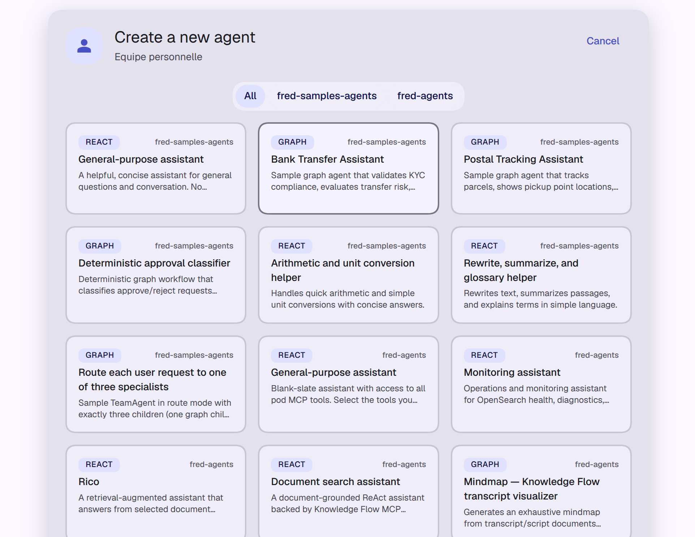
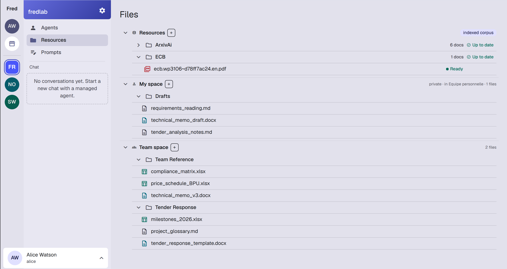
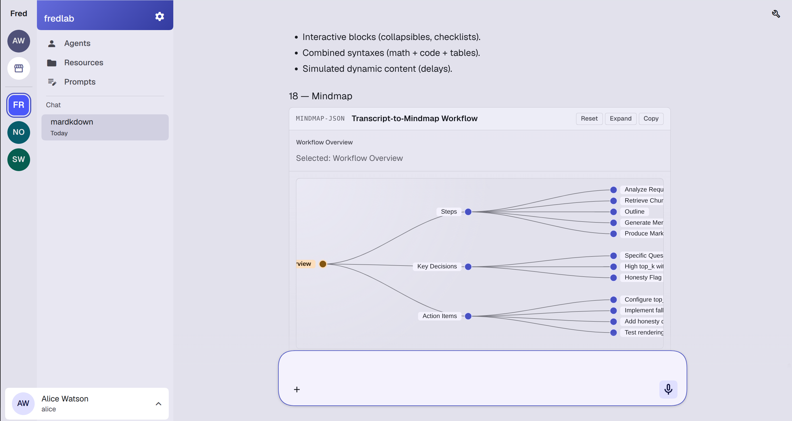

<!-- _class: title -->
<!-- _paginate: false -->
<!-- _header: '' -->

# Fred

## The Open Agentic Platform for the Enterprise

### Sovereign · production-grade · deployable anywhere

<small>An innovation first-contact: what we do — and where it meets your needs</small>

---

# Every large organization is asking the same question

## "How do we move agentic AI from demos into real operations?"

- Teams everywhere are **experimenting**: copilots, RAG prototypes, LLM scripts.
- Almost all of them stall at the same wall: **demo to production**.
- Security, governance, sovereignty and operations are left unsolved.
- Off-the-shelf SaaS rarely fits **regulated, on-prem or sovereign** constraints.

> The appetite is everywhere. The industrial foundation is what's missing.

---

# What Fred is

## Design agents · Ingest knowledge · Deploy anywhere

- **Agentic backend** — tool-using agents, sessions, streaming, model routing, orchestration.
- **Knowledge-flow backend** — ingestion, metadata, retrieval, content lifecycle (RAG).
- **Web frontend** — for end users *and* admins.
- **Governance primitives** — policy, RBAC/ReBAC, observability, model catalog.

> One open, modular foundation — from the LLM experiment to the operated system.

---

# Why Fred is different

## An open platform you own — not a vendor's black box

- **Sovereign by construction** — open source, on-prem or sovereign cloud, **no lock-in**.
- **Production-grade, not demoware** — auth, security, ops and deployment are built in.
- **Modular & extensible** — bring your own tools, models, agents and corpora.
- **Practitioner-driven** — shaped by teams running real systems, not slideware.

> You keep control of the models, the data, and the infrastructure.

---

# It already runs on sovereign infrastructure

## Not a lab project — deployed and operated for real

- ✅ Deployed on a **Tanzu** Kubernetes platform, at a **regulated security level**.
- 🎯 **Targeting a sovereign-cloud deployment (S3NS)** this summer.
- 🔁 Same platform, same code — from on-prem to sovereign cloud.

> The hard question — *"can this actually run in our environment?"* — is already answered.

---

<!-- _class: tour -->

# A platform your developers build on

> **ReAct or graph · samples, shared, or your own.** Simple assistants, RAG, deterministic workflows, multi-agent routers — designed in code and shipped as agentic apps to a Fred instance.

---

# What you can build on Fred

## Three convergence areas, common to every sector

- **AI for operations** — assistants over procedures, incident & anomaly investigation, decision support.
- **AI for internal business** — requirements traceability, document & process automation, compliance.
- **AI for your core business** — domain agents tailored to your products and your expertise.

> The same platform; you configure your own agents, corpora and prompts.

---

<!-- _class: tour -->

# Knowledge, organized and governed

> An indexed corpus, private drafts, and team-shared deliverables — every file with its state and its permissions.

---

<!-- _class: tour -->

# Agents that produce — not just chat

> From a raw document to an interactive mindmap of steps, decisions and action items: agents deliver artifacts, not just answers.

---

# Governed and secure by design

## Built for regulated and sensitive environments

- **Identity & access** — Keycloak, RBAC and fine-grained **ReBAC**.
- **Policy, not config** — model and routing rules expressed as governed policy.
- **Observability** — tracing, metrics and KPIs from day one.
- **Deploy where you must** — on-prem, private Kubernetes, or sovereign cloud.

> Security and governance are platform features — not afterthoughts.

---

# Adopt it on your terms

## Open, pragmatic, fast-moving — you stay in control

- **Start small** — one use case, one team, a focused proof of value.
- **No lock-in** — open source; your data, your models, your infrastructure.
- **Move fast** — a challenger's pace, without enterprise glue-code overhead.
- **Reuse, don't rebuild** — improvements compound across your use cases.

> You are never captive. You adopt as far and as fast as the value justifies.

---

# Where Fred stands today

## Open, proven, and gaining momentum

- **Open ecosystem** — `fred` + `fred-deployment-factory`, public on GitHub.
- **Proven path** — running on-prem at a regulated security level; sovereign cloud next.
- **Growing adoption** — increasingly a reference for teams industrializing agentic AI.
- **Practitioner-driven** — built by people shipping real systems.

> Not a research project. A platform you can adopt now.

---

<!-- _class: section-divider -->

# Let's start with one use case

## A focused proof of value — in weeks, not quarters

- **You pick** the operation, process or product where AI would help most.
- **We deliver** a working agent on that use case — on your infrastructure.
- **You judge** the value on something real, before committing further.

> Small, concrete, low-risk. The fastest way to see what Fred does for *you*.
